# Stage 1 Report — Project-Aware Research Consultant

**EECS 3311 — Software Design · Fall 2026 · York University**

A design report for a project-aware AI research assistant: a desktop application that
keeps a structured memory of a researcher's own project and uses it to judge which new
papers matter, how they compare, and whether their results are genuinely comparable.

**Contents**

| | Section |
|---|---|
| 1 | [Project Overview](#1-project-overview) — problem, users, agent, model, architecture |
| 2 | [Feature Specifications](#2-feature-specifications) — F01–F13 |
| 3 | [UML Class Diagram](#3-uml-class-diagram) |
| 4 | [Design Pattern Explanations](#4-design-pattern-explanations) — seven patterns |
| 5 | [Use-Case Diagram](#5-use-case-diagram) |
| 6 | [Use-Case Descriptions](#6-use-case-descriptions) — UC01–UC12 |
| 7 | [Sequence Diagrams](#7-sequence-diagrams) — SD01–SD09 |
| 8 | [Feature-to-Design Traceability](#8-feature-to-design-traceability) |
| 9 | [How Each Feature Is Realized](#9-how-each-feature-is-realized) |

Diagram sources are in [`diagrams/`](diagrams/); each diagram below also links a rendered
image.

## 1. Project Overview

**Problem.** Researchers tracking a fast-moving field spend significant time manually finding new papers, reading them in detail, and judging whether their results or methods are actually comparable to their own work. Generic literature-search tools don't know anything about the researcher's own project, so they can't say "this paper matters *for you*" or "your results aren't directly comparable to theirs."

**Target users.** Graduate students and researchers actively running an experimental project (datasets, models, metrics, results) who need to stay current with related work without re-reading the whole literature every week.

**What the agent does.** It builds and maintains a structured memory of the researcher's own project, continuously monitors new papers, analyzes them into a structured form, classifies them by strategy, and compares them against the researcher's own problem, methods, and results — flagging what's actually relevant and whether comparisons are valid.

**Why an agent.** This requires multi-step reasoning (retrieve → extract → compare → judge relevance), tool use (literature APIs, GitHub, local file reading), and persistent memory across sessions — a single LLM call cannot do this; it needs planning and sequenced tool use.

**AI/LLM model(s).** Claude (Anthropic Messages API) is the planned model for all agent reasoning — extraction, classification, comparison and summarisation. It is reached only through the `LLMClient` interface (`ClaudeClient` is the concrete adapter), so a different provider can be substituted without touching any agent. No model is called directly by the GUI, the CLI or the deterministic services.

**Architecture.** A JavaFX desktop GUI and a CLI both sit on top of a shared service/agent layer. Agents (Paper Discovery, Paper Analysis, Research Consultant, Project Context, Repository Analysis) reason about which tools to invoke; the tools themselves (literature API client, GitHub client, local file reader, project-memory store) are deterministic services the agents call through a restricted `ToolManager`.

## 2. Feature Specifications

Each feature below is specified by: identifier and name, description, how the user
interacts with it through the GUI, its input, its output, whether it is deterministic,
AI-driven or hybrid, its workflow, and the error and alternative cases it must handle.

### F01 — Project Profile Setup
- **Description:** Create and edit the researcher's project profile: research question, datasets, models, metrics, current results.
- **GUI interaction:** A profile form/editor screen.
- **Input:** Free-text fields (question, datasets, models, metrics) and structured results entries.
- **Output:** A saved project profile shown in the dashboard.
- **AI involvement:** Deterministic.
- **Workflow:** User fills the form → `AppController.saveProfile()` validates the fields and `ProjectMemory` persists the profile.
- **Errors:** Missing required fields rejected with inline validation messages.

### F02 — Import Project Context
- **Description:** Read the live state of the researcher's project (code, config files, experiment results, Git history) from a local project directory.
- **GUI interaction:** "Import project" button, pick a directory.
- **Input:** A local filesystem path.
- **Output:** Extracted facts (recent commits, config values, result files found) merged into project memory, plus — when a coding agent is available — a description of what the project is currently *doing*.
- **AI involvement:** Hybrid — file reading is deterministic; summarizing what changed uses the LLM.
- **Workflow:** `ProjectContextAgent` asks a `ProjectContextProvider` to scan the path, then summarizes notable changes. Two providers implement that interface and the agent cannot tell which one answered:
  - `ClaudeCodeContextProvider` delegates to a coding agent already working in the directory and asks it to describe the project's current state. This yields *intent* — what is being refactored, what is deliberately broken, what is in progress — which a file diff cannot express.
  - `FileBasedContextProvider` reads the directory directly: Git history, config files, result files. This yields *facts* only, but has no external dependency.
- **Provider selection:** the Claude Code provider is attempted first when a coding agent is available in the target directory; otherwise the system falls back to the file-based provider. The fallback is silent to the agent but reported in the UI, so the researcher knows which kind of context they are looking at.
- **Errors:** Invalid/inaccessible path reported; partial read (e.g. no Git repo found) degrades gracefully rather than failing. If the coding agent is unavailable, times out, or returns something unparseable, the system falls back to the file-based provider rather than failing the import.
- **Implementation commitment:** `FileBasedContextProvider` is the implementation committed for Stage 2. `ClaudeCodeContextProvider` is designed here and treated as a stretch goal — the Adapter in section 4 is what makes adding it a new class rather than a change to `ProjectContextAgent`.

### F03 — Discover New Papers
- **Description:** Search literature sources for papers relevant to the project's research question.
- **GUI interaction:** "Discover papers" action; results appear in a paper feed.
- **Input:** The project's research question/keywords (from F01).
- **Output:** A ranked list of candidate papers (title, venue, date, relevance note).
- **AI involvement:** AI — the Paper Discovery Agent plans queries and judges relevance.
- **Workflow:** Agent calls the literature-API tool with generated queries → filters/ranks by relevance to the project profile.
- **Errors:** API failure shows a retry option; zero results shown explicitly rather than silently empty.

### F04 — Analyze a Paper
- **Description:** Extract structured information from a paper: problem, method, dataset, model, metrics, results, limitations.
- **GUI interaction:** Click a paper in the feed → "Analyze".
- **Input:** A paper (PDF/abstract text or identifier).
- **Output:** A structured analysis record attached to the paper.
- **AI involvement:** AI — Paper Analysis Agent.
- **Workflow:** Agent reads the paper text via a parsing tool → extracts each field → stores the structured record.
- **Errors:** Unparseable PDF flagged; partial extraction still saved with missing fields marked unknown.

### F05 — Classify Paper by Strategy
- **Description:** Tag an analyzed paper with the methodological strategy/technique it uses.
- **GUI interaction:** Shown automatically on the paper's detail view; filterable paper list by strategy tag.
- **Input:** A paper's structured analysis (F04 output).
- **Output:** One or more strategy tags.
- **AI involvement:** AI.
- **Workflow:** Agent classifies using the extracted method/approach fields against a strategy taxonomy.
- **Errors:** Low-confidence classification marked as "uncertain" rather than guessed silently.

### F06 — Compare Paper to Own Project
- **Description:** Explain how a paper's approach differs from (or resembles) the researcher's own project.
- **GUI interaction:** "Compare" button on a paper's detail view.
- **Input:** A paper's analysis + the project profile.
- **Output:** A structured comparison: similarities, differences, what's novel.
- **AI involvement:** AI — Research Consultant Agent.
- **Workflow:** Agent reasons over both structured records and produces a comparison with citations back to specific paper fields.
- **Errors:** If project profile is incomplete, the agent reports which fields are missing rather than guessing.

### F07 — Comparability Check
- **Description:** Determine whether a paper's reported results are actually comparable to the researcher's own (same dataset, metric, split).
- **GUI interaction:** Part of the comparison view (F06); shown as a clear yes/no/partial badge with explanation.
- **Input:** Paper's dataset/metric/results + the project's own dataset/metric/results.
- **Output:** A comparability verdict with the specific mismatch, if any.
- **AI involvement:** Hybrid — the dataset/metric/split match is a deterministic structured check; the explanation is AI-generated.
- **Workflow:** Deterministic matcher checks fields; agent explains the result in context.
- **Errors:** Unknown/unspecified fields on either side marked explicitly as "cannot determine," not treated as a match or mismatch.

### F08 — "Has Anyone Tried This" Search
- **Description:** Search existing literature and the project's own analyzed-paper history for prior evidence of an idea.
- **GUI interaction:** A free-text query box ("has anyone tried...").
- **Input:** A natural-language idea description.
- **Output:** The closest matching evidence found, with sources and a confidence note — not a definitive yes/no.
- **AI involvement:** AI.
- **Workflow:** Agent searches both the live literature tool and the local analyzed-paper memory, then synthesizes.
- **Errors:** No matches found is reported as such, not as "no one has tried this."

### F09 — Repository Analysis
- **Description:** Check whether a paper provides a GitHub repository and summarize its code/reproducibility.
- **GUI interaction:** "Check code" button on a paper's detail view.
- **Input:** A paper's linked repository URL (if any).
- **Output:** A summary: presence of code, README quality, license, whether datasets/eval scripts are included.
- **AI involvement:** Hybrid — fetching repo metadata is deterministic; summarizing is AI.
- **Workflow:** Repository Analysis Agent calls the GitHub API tool (read-only; downloaded code is never executed) and summarizes.
- **Errors:** No repository found is reported plainly; private/inaccessible repos reported as such.

### F10 — Project Change Summary
- **Description:** Summarize what changed recently in the researcher's own project.
- **GUI interaction:** "What changed" panel on the dashboard.
- **Input:** Git history and file changes since the last check (from F02).
- **Output:** A short natural-language summary of recent changes.
- **AI involvement:** Hybrid.
- **Workflow:** `ProjectContextProvider` diffs the current scan against the last stored one → agent summarizes the diff.
- **Errors:** No prior scan to diff against is reported, with a prompt to import first.

### F11 — Project-Aware Chat
- **Description:** Ask free-form questions that are answered using the project profile and analyzed-paper memory.
- **GUI interaction:** A chat panel.
- **Input:** A natural-language question.
- **Output:** An answer grounded in stored project/paper data, with references to the records used.
- **AI involvement:** AI.
- **Workflow:** Agent retrieves relevant project/paper records, then answers using only that retrieved context.
- **Errors:** If no relevant records are found, the agent says so rather than answering from general knowledge.

### F12 — Weekly Digest
- **Description:** A scheduled summary of newly discovered papers and any project changes.
- **GUI interaction:** A digest view, also available via the CLI (e.g. `digest` command).
- **Input:** None (runs on the project's stored state).
- **Output:** A formatted digest (new papers, classification highlights, project changes).
- **AI involvement:** Hybrid — assembly is deterministic, the summary text is AI-generated.
- **Workflow:** Scheduled/triggered job pulls recent F03/F04/F10 results and composes the digest.
- **Errors:** Nothing new to report is shown explicitly, not an empty/broken-looking screen.

### F13 — Solution Landscape
- **Description:** Build and browse a hierarchical map of the solution approaches found across the analysed papers, with a synthesised "main idea" for each branch and a marker showing where the researcher's own approach sits.
- **GUI interaction:** A "Strategies" view — the taxonomy tree on the left, the selected branch's main idea, its sibling contrast and its papers on the right. A "Rebuild" action refreshes it.
- **Input:** The stored `PaperAnalysis` records (F04/F05 output) and the project profile.
- **Output:** A tree of `StrategyNode`s with per-branch summaries and paper counts, with the branch matching the researcher's own method flagged.
- **AI involvement:** Hybrid — the fixed top-level categories and all tree traversal are deterministic; proposing sub-branches, placing papers and writing branch summaries are AI.
- **Workflow:** `StrategyTaxonomy.seedRoots()` creates the fixed top-level categories → `ResearchConsultantAgent.buildLandscape()` groups the analyses into proposed sub-branches beneath them → `summarizeBranch()` writes each branch's main idea → the branch matching the profile is flagged → the tree is stored in `ProjectMemory`.
- **Errors:** Too few analysed papers to derive sub-branches — the seeded roots are shown with that stated explicitly. A paper that fits no branch is placed under an explicit "Unclassified" node rather than forced into the nearest one. If the LLM is unavailable the tree is still built from the fixed roots and the stored strategy tags, with branch summaries marked unavailable.

## 3. UML Class Diagram

The structure of the system: its classes and interfaces, their important attributes and
methods, and the relationships between them. Source: [`diagrams/class-diagram.mmd`](diagrams/class-diagram.mmd).

**On notation.** The abstract class `Agent` is marked with the `«abstract»` stereotype
rather than italics, which the diagram tool cannot produce. Each design pattern is
labelled with an attached note, and section 4 shows every pattern again as its own
focused diagram.

**Reading the relationships.** Filled diamonds (composition) mark ownership with
a shared lifetime: `ProjectMemory` owns the profile, the stored analyses and the
last context snapshot, and `AppController` owns the `ToolManager`. Hollow
diamonds (aggregation) mark containment without ownership — `AppController`
holds the five agents, a `Digest` collects papers that outlive it. Plain arrows
are uses-a associations, and dashed arrows mark objects a class creates or
returns. `ProjectMemory` is deliberately associated with, not composed into,
`AppController`, because as a singleton its lifetime is independent of any one
caller.

```mermaid
classDiagram
    direction TB

    %% ---------- Boundary: GUI + CLI (Facade clients) ----------
    class MainGUI {
        -controller: AppController
        +showDashboard()
        +showPaperFeed()
        +showPaperDetail(a: PaperAnalysis)
        +showComparison(r: ComparisonResult)
        +showDigest(d: Digest)
        +showSolutionLandscape(root: StrategyNode)
    }
    class CLI {
        -controller: AppController
        +run(args: String[])
    }
    class AppController {
        -memory: ProjectMemory
        -tools: ToolManager
        +saveProfile(p: ProjectProfile)
        +importProjectContext(path: String) ContextSnapshot
        +discoverPapers() List~PaperRecord~
        +analyzePaper(p: PaperRecord) PaperAnalysis
        +classifyPaper(a: PaperAnalysis) List~String~
        +comparePaper(a: PaperAnalysis) ComparisonResult
        +searchPriorWork(idea: String) List~PaperAnalysis~
        +checkRepository(a: PaperAnalysis) RepoSummary
        +summarizeProjectChanges() String
        +ask(question: String) String
        +buildDigest() Digest
        +buildSolutionLandscape() StrategyNode
    }
    MainGUI "1" --> "1" AppController
    CLI "1" --> "1" AppController

    %% ---------- Agents (Template Method) ----------
    class Agent {
        <<abstract>>
        #tools: ToolManager
        +run(input: Object) Object
        #plan(input: Object) Plan
        #executeTools(plan: Plan) Object
        #summarize(result: Object) Object
    }
    class Plan {
        -steps: List~String~
        -toolCalls: List~String~
        +addStep(s: String)
        +getToolCalls() List~String~
    }
    class PaperDiscoveryAgent {
        -listeners: List~PaperFeedListener~
        #plan(input: Object) Plan
        #executeTools(plan: Plan) Object
        #summarize(result: Object) Object
        +addListener(l: PaperFeedListener)
        +notifyListeners(p: PaperRecord)
    }
    class PaperAnalysisAgent {
        -taxonomy: StrategyTaxonomy
        #plan(input: Object) Plan
        #executeTools(plan: Plan) Object
        #summarize(result: Object) Object
        +classify(a: PaperAnalysis) List~String~
    }
    class ResearchConsultantAgent {
        -checker: ComparabilityChecker
        #plan(input: Object) Plan
        #executeTools(plan: Plan) Object
        #summarize(result: Object) Object
        +compare(a: PaperAnalysis, p: ProjectProfile) ComparisonResult
        +buildLandscape(items: List~PaperAnalysis~, p: ProjectProfile) StrategyNode
        +summarizeBranch(n: StrategyNode) String
    }
    class ProjectContextAgent {
        -providers: List~ProjectContextProvider~
        #plan(input: Object) Plan
        #executeTools(plan: Plan) Object
        #summarize(result: Object) Object
        +summarizeChanges(old: ContextSnapshot, cur: ContextSnapshot) String
        +selectProvider(path: String) ProjectContextProvider
    }
    class RepositoryAnalysisAgent {
        #plan(input: Object) Plan
        #executeTools(plan: Plan) Object
        #summarize(result: Object) Object
    }
    Agent <|-- PaperDiscoveryAgent
    Agent <|-- PaperAnalysisAgent
    Agent <|-- ResearchConsultantAgent
    Agent <|-- ProjectContextAgent
    Agent <|-- RepositoryAnalysisAgent
    AppController "1" o-- "5" Agent
    Agent ..> Plan : creates

    %% ---------- Tool layer ----------
    class ToolManager {
        -literatureSource: LiteratureSource
        -llm: LLMClient
        -github: GitHubClient
        -parser: PaperParser
        +setLiteratureSource(s: LiteratureSource)
        +search(query: String) List~PaperRecord~
        +callLLM(prompt: String) String
        +fetchRepo(url: String) RepoMetadata
        +parsePaper(p: PaperRecord) String
    }
    AppController "1" *-- "1" ToolManager
    Agent "0..*" --> "1" ToolManager

    class LiteratureSource {
        <<interface>>
        +search(query: String) List~PaperRecord~
    }
    class ArxivSource {
        +search(query: String) List~PaperRecord~
    }
    class SemanticScholarSource {
        +search(query: String) List~PaperRecord~
    }
    LiteratureSource <|.. ArxivSource
    LiteratureSource <|.. SemanticScholarSource
    ToolManager "1" --> "1" LiteratureSource

    class LLMClient {
        <<interface>>
        +generate(prompt: String) String
    }
    class ClaudeClient {
        +generate(prompt: String) String
    }
    LLMClient <|.. ClaudeClient
    ToolManager "1" --> "1" LLMClient

    class GitHubClient {
        +fetchRepo(url: String) RepoMetadata
    }
    class PaperParser {
        +parse(p: PaperRecord) String
    }
    ToolManager "1" *-- "1" GitHubClient
    ToolManager "1" *-- "1" PaperParser
    GitHubClient ..> RepoMetadata : returns

    %% ---------- Project context (Adapter) ----------
    class ProjectContextProvider {
        <<interface>>
        +scan(path: String) ContextSnapshot
        +isAvailable(path: String) Boolean
    }
    class FileBasedContextProvider {
        +scan(path: String) ContextSnapshot
        +isAvailable(path: String) Boolean
    }
    class ClaudeCodeContextProvider {
        +scan(path: String) ContextSnapshot
        +isAvailable(path: String) Boolean
    }
    ProjectContextProvider <|.. FileBasedContextProvider
    ProjectContextProvider <|.. ClaudeCodeContextProvider
    ProjectContextAgent "1" --> "1..*" ProjectContextProvider : tries in order
    ProjectContextProvider ..> ContextSnapshot : returns

    %% ---------- Deterministic domain services ----------
    class ComparabilityChecker {
        +isComparable(a: PaperAnalysis, p: ProjectProfile) Boolean
        +findMismatches(a: PaperAnalysis, p: ProjectProfile) List~String~
    }
    class StrategyTaxonomy {
        -knownStrategies: List~String~
        -root: StrategyNode
        +match(method: String) List~String~
        +isKnown(tag: String) Boolean
        +seedRoots() StrategyNode
        +getRoot() StrategyNode
    }
    class StrategyNode {
        -name: String
        -mainIdea: String
        -ownApproach: Boolean
        -children: List~StrategyNode~
        -papers: List~PaperAnalysis~
        +add(child: StrategyNode)
        +remove(child: StrategyNode)
        +getChildren() List~StrategyNode~
        +paperCount() int
        +isLeaf() Boolean
    }
    StrategyTaxonomy "1" *-- "1" StrategyNode : root
    StrategyNode "1" o-- "0..*" StrategyNode : children
    StrategyNode "1" o-- "0..*" PaperAnalysis
    ResearchConsultantAgent ..> StrategyNode : builds
    ResearchConsultantAgent "1" --> "1" ComparabilityChecker
    PaperAnalysisAgent "1" --> "1" StrategyTaxonomy

    %% ---------- Memory (Singleton) ----------
    class ProjectMemory {
        <<Singleton>>
        -instance: ProjectMemory
        -profile: ProjectProfile
        -papers: List~PaperAnalysis~
        -lastSnapshot: ContextSnapshot
        -landscape: StrategyNode
        +getInstance() ProjectMemory
        +saveProfile(p: ProjectProfile)
        +getProfile() ProjectProfile
        +addPaperAnalysis(a: PaperAnalysis)
        +getPaperAnalyses() List~PaperAnalysis~
        +saveSnapshot(s: ContextSnapshot)
        +getLastSnapshot() ContextSnapshot
        +saveLandscape(root: StrategyNode)
        +getLandscape() StrategyNode
    }
    AppController "1" --> "1" ProjectMemory

    %% ---------- Domain / data classes ----------
    class ProjectProfile {
        -researchQuestion: String
        -datasets: List~String~
        -models: List~String~
        -metrics: List~String~
        -ownResults: List~String~
    }
    class PaperRecord {
        -title: String
        -venue: String
        -date: String
        -repoUrl: String
    }
    class PaperAnalysis {
        -paper: PaperRecord
        -problem: String
        -method: String
        -dataset: String
        -metrics: List~String~
        -results: String
        -limitations: String
        -strategyTags: List~String~
    }
    class ComparisonResult {
        -similarities: List~String~
        -differences: List~String~
        -comparable: Boolean
        -comparabilityNote: String
    }
    class ContextSnapshot {
        -scannedAt: String
        -recentCommits: List~String~
        -configEntries: List~String~
        -resultFiles: List~String~
    }
    class RepoMetadata {
        -url: String
        -hasReadme: Boolean
        -license: String
        -topLevelFiles: List~String~
    }
    class RepoSummary {
        -codeAvailable: Boolean
        -readmeQuality: String
        -license: String
        -hasDatasets: Boolean
        -hasEvalScripts: Boolean
    }
    class Digest {
        -generatedAt: String
        -newPapers: List~PaperRecord~
        -projectChanges: String
        -summaryText: String
    }
    ProjectMemory "1" *-- "1" ProjectProfile
    ProjectMemory "1" *-- "0..*" PaperAnalysis
    ProjectMemory "1" *-- "0..1" ContextSnapshot
    ProjectMemory "1" *-- "0..1" StrategyNode
    PaperAnalysis "1" --> "1" PaperRecord
    ResearchConsultantAgent ..> ComparisonResult : creates
    RepositoryAnalysisAgent ..> RepoSummary : creates

    %% ---------- Observer ----------
    class PaperFeedListener {
        <<interface>>
        +onNewPaper(p: PaperRecord)
    }
    class PaperFeedPanel {
        +onNewPaper(p: PaperRecord)
    }
    class DigestBuilder {
        +onNewPaper(p: PaperRecord)
        +buildDigest() Digest
        +buildSolutionLandscape() StrategyNode
    }
    PaperFeedListener <|.. PaperFeedPanel
    PaperFeedListener <|.. DigestBuilder
    PaperDiscoveryAgent "1" --> "0..*" PaperFeedListener
    DigestBuilder ..> Digest : creates
    Digest "1" o-- "0..*" PaperRecord

    note for AppController "Facade - one method per feature F01-F13,<br/>so MainGUI and CLI never touch the subsystem"
    note for Agent "Template Method - run() fixes the order;<br/>subclasses override the protected hooks only"
    note for LiteratureSource "Strategy - interchangeable search sources,<br/>swapped via ToolManager.setLiteratureSource()"
    note for LLMClient "Adapter - wraps one provider's API<br/>behind the interface the agents expect"
    note for ProjectContextProvider "Adapter - two sources of project context,<br/>selected at runtime with isAvailable()"
    note for PaperFeedListener "Observer - PaperDiscoveryAgent broadcasts;<br/>listeners react independently"
    note for ProjectMemory "Singleton - one shared project state<br/>for every agent, the GUI and the CLI"
    note for StrategyNode "Composite - a node with no children is a leaf,<br/>so one recursive walk handles any depth"
```

*Also available as a [rendered image](diagrams/class-diagram-render.png).*

## 4. Design Pattern Explanations

### Facade — `AppController`

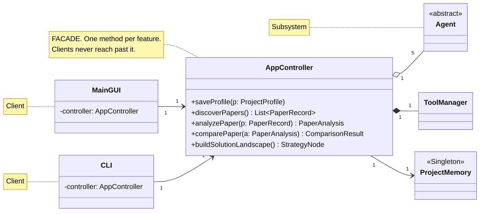
```mermaid
classDiagram
    direction LR
    class MainGUI {
        -controller: AppController
    }
    class CLI {
        -controller: AppController
    }
    class AppController {
        +saveProfile(p: ProjectProfile)
        +discoverPapers() List~PaperRecord~
        +analyzePaper(p: PaperRecord) PaperAnalysis
        +comparePaper(a: PaperAnalysis) ComparisonResult
        +buildSolutionLandscape() StrategyNode
    }
    class Agent {
        <<abstract>>
    }
    class ToolManager
    class ProjectMemory {
        <<Singleton>>
    }
    MainGUI "1" --> "1" AppController
    CLI "1" --> "1" AppController
    AppController "1" o-- "5" Agent
    AppController "1" *-- "1" ToolManager
    AppController "1" --> "1" ProjectMemory
    note for AppController "FACADE. One method per feature.<br/>Clients never reach past it."
    note for MainGUI "Client"
    note for CLI "Client"
    note for Agent "Subsystem"
```

*Also available as a [rendered image](diagrams/patterns/pattern-facade.png).*

*Source: `diagrams/patterns/pattern-facade.mmd`*

- **Problem:** `MainGUI` and `CLI` would otherwise each need to know how to
  construct and wire together every agent and the `ToolManager` themselves,
  duplicating setup logic and coupling both entry points to internal details.
- **Participating classes:** `AppController` (the facade), `Agent` subclasses,
  `ToolManager`, `ProjectMemory` (the subsystem it hides).
- **Roles:** `AppController` exposes one simple method per feature
  (`discoverPapers()`, `analyzePaper()`, ...); internally it owns and
  coordinates the agents and memory.
- **Why appropriate:** GUI and CLI are two independent clients needing the
  same operations; a facade avoids duplicating orchestration logic in both.
- **Without it:** every GUI action and every CLI command would separately
  construct agents and tools, and any change to how agents are wired would
  need updating in two places.

### Template Method — `Agent`

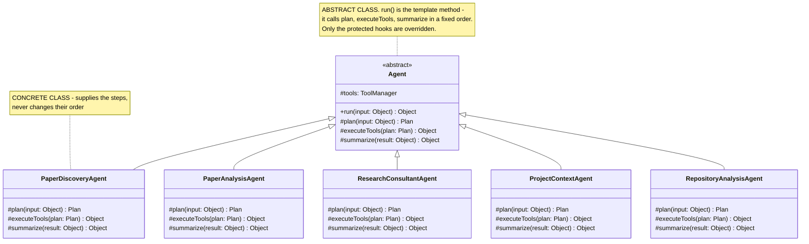
```mermaid
classDiagram
    direction TB
    class Agent {
        <<abstract>>
        #tools: ToolManager
        +run(input: Object) Object
        #plan(input: Object) Plan
        #executeTools(plan: Plan) Object
        #summarize(result: Object) Object
    }
    class PaperDiscoveryAgent {
        #plan(input: Object) Plan
        #executeTools(plan: Plan) Object
        #summarize(result: Object) Object
    }
    class PaperAnalysisAgent {
        #plan(input: Object) Plan
        #executeTools(plan: Plan) Object
        #summarize(result: Object) Object
    }
    class ResearchConsultantAgent {
        #plan(input: Object) Plan
        #executeTools(plan: Plan) Object
        #summarize(result: Object) Object
    }
    class ProjectContextAgent {
        #plan(input: Object) Plan
        #executeTools(plan: Plan) Object
        #summarize(result: Object) Object
    }
    class RepositoryAnalysisAgent {
        #plan(input: Object) Plan
        #executeTools(plan: Plan) Object
        #summarize(result: Object) Object
    }
    Agent <|-- PaperDiscoveryAgent
    Agent <|-- PaperAnalysisAgent
    Agent <|-- ResearchConsultantAgent
    Agent <|-- ProjectContextAgent
    Agent <|-- RepositoryAnalysisAgent
    note for Agent "ABSTRACT CLASS. run() is the template method -<br/>it calls plan, executeTools, summarize in a fixed order.<br/>Only the protected hooks are overridden."
    note for PaperDiscoveryAgent "CONCRETE CLASS - supplies the steps,<br/>never changes their order"
```

*Also available as a [rendered image](diagrams/patterns/pattern-template-method.png).*

*Source: `diagrams/patterns/pattern-template-method.mmd`*

- **Problem:** every agent follows the same reasoning shape (plan which
  tools to use, execute them, summarize the result), but the specifics
  differ per agent.
- **Participating classes:** `Agent` (abstract, defines `run()`), the five
  concrete agents (`PaperDiscoveryAgent`, `PaperAnalysisAgent`,
  `ResearchConsultantAgent`, `ProjectContextAgent`, `RepositoryAnalysisAgent`).
- **Roles:** `Agent.run()` is the fixed template calling `plan()`,
  `executeTools()`, `summarize()` in order; each subclass overrides those
  three steps with its own logic.
- **Why appropriate:** keeps the overall agent loop in one place, so every
  agent stays consistent, while each one still customizes what it actually
  does.
- **Without it:** each agent would reimplement its own plan/execute/summarize
  loop, risking inconsistent behaviour (e.g. one agent forgetting to log
  which tools it used).

### Strategy — `LiteratureSource`

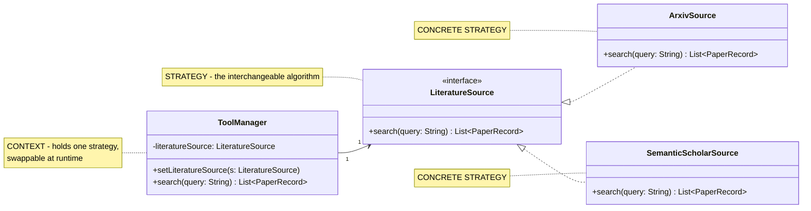
```mermaid
classDiagram
    direction LR
    class ToolManager {
        -literatureSource: LiteratureSource
        +setLiteratureSource(s: LiteratureSource)
        +search(query: String) List~PaperRecord~
    }
    class LiteratureSource {
        <<interface>>
        +search(query: String) List~PaperRecord~
    }
    class ArxivSource {
        +search(query: String) List~PaperRecord~
    }
    class SemanticScholarSource {
        +search(query: String) List~PaperRecord~
    }
    LiteratureSource <|.. ArxivSource
    LiteratureSource <|.. SemanticScholarSource
    ToolManager "1" --> "1" LiteratureSource
    note for ToolManager "CONTEXT - holds one strategy,<br/>swappable at runtime"
    note for LiteratureSource "STRATEGY - the interchangeable algorithm"
    note for ArxivSource "CONCRETE STRATEGY"
    note for SemanticScholarSource "CONCRETE STRATEGY"
```

*Also available as a [rendered image](diagrams/patterns/pattern-strategy.png).*

*Source: `diagrams/patterns/pattern-strategy.mmd`*

- **Problem:** which literature API to query (arXiv, Semantic Scholar, ...)
  should be swappable without changing `ToolManager` or any agent.
- **Participating classes:** `LiteratureSource` (interface), `ArxivSource`,
  `SemanticScholarSource` (concrete strategies), `ToolManager` (context that
  holds and uses the chosen strategy).
- **Roles:** `ToolManager.search()` delegates to whichever `LiteratureSource`
  it currently holds, without knowing which concrete one it is.
- **Why appropriate:** lets the project add or switch literature sources
  (e.g. for coverage or rate-limit reasons) as a configuration change, not a
  code change in the agents.
- **Without it:** `ToolManager` would need an if/else per literature API,
  and every agent calling it would risk depending on a specific API's shape.

### Adapter — `LLMClient` and `ProjectContextProvider`

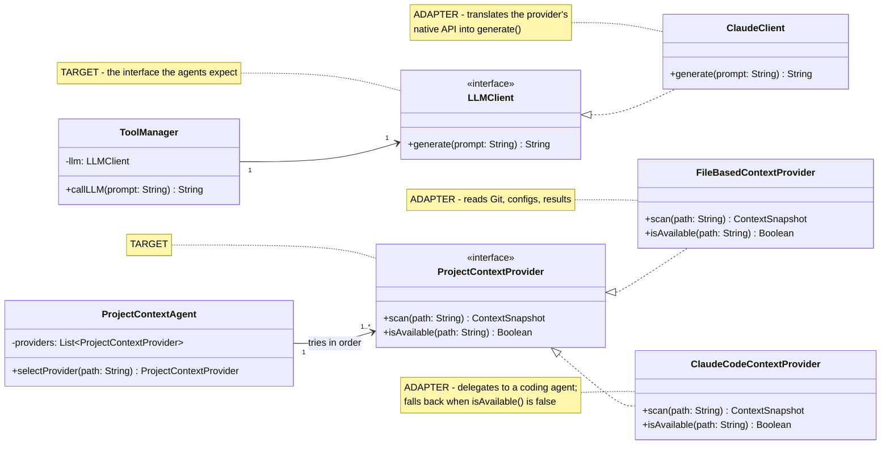
```mermaid
classDiagram
    direction LR
    class ToolManager {
        -llm: LLMClient
        +callLLM(prompt: String) String
    }
    class LLMClient {
        <<interface>>
        +generate(prompt: String) String
    }
    class ClaudeClient {
        +generate(prompt: String) String
    }
    class ProjectContextAgent {
        -providers: List~ProjectContextProvider~
        +selectProvider(path: String) ProjectContextProvider
    }
    class ProjectContextProvider {
        <<interface>>
        +scan(path: String) ContextSnapshot
        +isAvailable(path: String) Boolean
    }
    class FileBasedContextProvider {
        +scan(path: String) ContextSnapshot
        +isAvailable(path: String) Boolean
    }
    class ClaudeCodeContextProvider {
        +scan(path: String) ContextSnapshot
        +isAvailable(path: String) Boolean
    }
    LLMClient <|.. ClaudeClient
    ToolManager "1" --> "1" LLMClient
    ProjectContextProvider <|.. FileBasedContextProvider
    ProjectContextProvider <|.. ClaudeCodeContextProvider
    ProjectContextAgent "1" --> "1..*" ProjectContextProvider : tries in order
    note for LLMClient "TARGET - the interface the agents expect"
    note for ClaudeClient "ADAPTER - translates the provider's<br/>native API into generate()"
    note for ProjectContextProvider "TARGET"
    note for ClaudeCodeContextProvider "ADAPTER - delegates to a coding agent;<br/>falls back when isAvailable() is false"
    note for FileBasedContextProvider "ADAPTER - reads Git, configs, results"
```

*Also available as a [rendered image](diagrams/patterns/pattern-adapter.png).*

*Source: `diagrams/patterns/pattern-adapter.mmd`*

- **Problem:** agents need a uniform way to call an LLM and to read project
  context, but the underlying providers (a specific LLM API; local files vs.
  a coding-agent integration) have different native interfaces.
- **Participating classes:** `LLMClient` (interface) with `ClaudeClient`
  (adapter); `ProjectContextProvider` (interface) with
  `FileBasedContextProvider` and `ClaudeCodeContextProvider` (adapters).
- **Roles:** each adapter translates a specific provider's API into the
  common interface the rest of the system expects.
- **Why appropriate:** the two context providers are not merely
  interchangeable in principle — the system chooses between them *at runtime*.
  `ProjectContextAgent.selectProvider()` probes `isAvailable()` and prefers
  `ClaudeCodeContextProvider`, which can describe what the project is currently
  doing, falling back to `FileBasedContextProvider` when no coding agent is
  present. The agent that consumes the `ContextSnapshot` never learns which
  one answered, so a failing stretch-goal integration degrades to plain file
  reading instead of breaking the import. The same reasoning applies to
  `LLMClient` if the provider changes.
- **Without it:** `ProjectContextAgent` would need branching logic for every
  source of project context, and the fallback path would have to be
  reimplemented at each call site. Switching LLM providers would likewise
  require changing every agent that calls one directly.

### Observer — `PaperFeedListener`

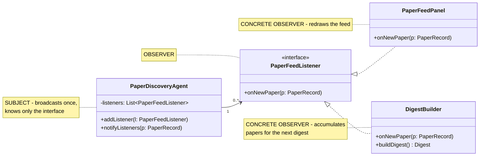
```mermaid
classDiagram
    direction LR
    class PaperDiscoveryAgent {
        -listeners: List~PaperFeedListener~
        +addListener(l: PaperFeedListener)
        +notifyListeners(p: PaperRecord)
    }
    class PaperFeedListener {
        <<interface>>
        +onNewPaper(p: PaperRecord)
    }
    class PaperFeedPanel {
        +onNewPaper(p: PaperRecord)
    }
    class DigestBuilder {
        +onNewPaper(p: PaperRecord)
        +buildDigest() Digest
    }
    PaperFeedListener <|.. PaperFeedPanel
    PaperFeedListener <|.. DigestBuilder
    PaperDiscoveryAgent "1" --> "0..*" PaperFeedListener
    note for PaperDiscoveryAgent "SUBJECT - broadcasts once,<br/>knows only the interface"
    note for PaperFeedListener "OBSERVER"
    note for PaperFeedPanel "CONCRETE OBSERVER - redraws the feed"
    note for DigestBuilder "CONCRETE OBSERVER - accumulates<br/>papers for the next digest"
```

*Also available as a [rendered image](diagrams/patterns/pattern-observer.png).*

*Source: `diagrams/patterns/pattern-observer.mmd`*

- **Problem:** both the GUI's paper feed and the digest builder need to
  react whenever `PaperDiscoveryAgent` finds a new paper, without that agent
  needing to know either of them exists.
- **Participating classes:** `PaperFeedListener` (interface), `PaperFeedPanel`
  and `DigestBuilder` (concrete observers), `PaperDiscoveryAgent` (subject).
- **Roles:** `PaperDiscoveryAgent` notifies every registered
  `PaperFeedListener` when a paper is found; each listener decides what to
  do with that notification independently.
- **Why appropriate:** the set of things that care about new papers can grow
  (e.g. a future email-alert feature) without modifying the discovery agent.
- **Without it:** `PaperDiscoveryAgent` would need direct references to the
  GUI and the digest builder, coupling a backend agent to UI/reporting code.

### Singleton — `ProjectMemory`

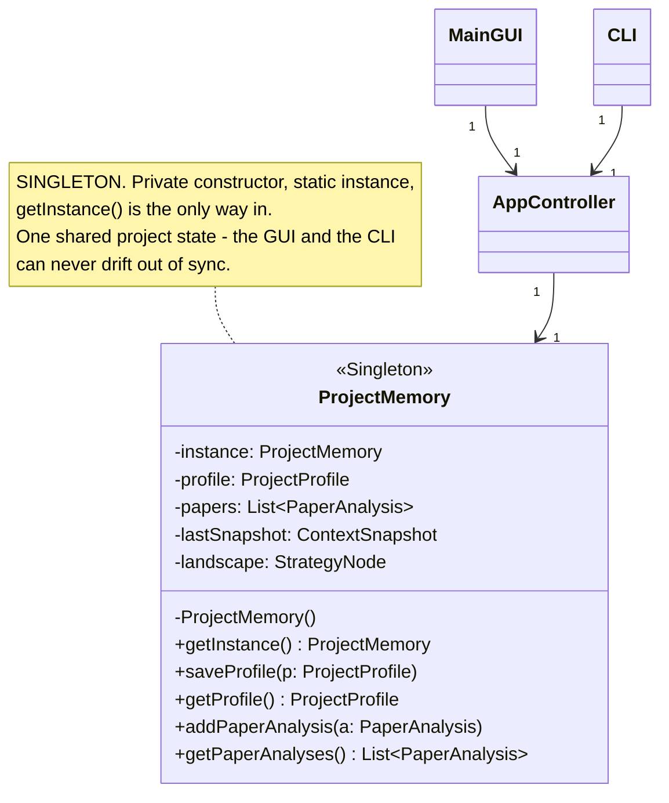
```mermaid
classDiagram
    direction TB
    class ProjectMemory {
        <<Singleton>>
        -instance: ProjectMemory
        -profile: ProjectProfile
        -papers: List~PaperAnalysis~
        -lastSnapshot: ContextSnapshot
        -landscape: StrategyNode
        -ProjectMemory()
        +getInstance() ProjectMemory
        +saveProfile(p: ProjectProfile)
        +getProfile() ProjectProfile
        +addPaperAnalysis(a: PaperAnalysis)
        +getPaperAnalyses() List~PaperAnalysis~
    }
    class AppController
    class MainGUI
    class CLI
    MainGUI "1" --> "1" AppController
    CLI "1" --> "1" AppController
    AppController "1" --> "1" ProjectMemory
    note for ProjectMemory "SINGLETON. Private constructor, static instance,<br/>getInstance() is the only way in.<br/>One shared project state - the GUI and the CLI<br/>can never drift out of sync."
```

*Also available as a [rendered image](diagrams/patterns/pattern-singleton.png).*

*Source: `diagrams/patterns/pattern-singleton.mmd`*

- **Problem:** the project profile and analyzed papers must be a single
  shared source of truth; having multiple independent copies could let
  different parts of the app disagree about the project's state.
- **Participating classes:** `ProjectMemory`.
- **Roles:** `ProjectMemory` controls its own single instance and is the
  only place project state is read from or written to.
- **Why appropriate:** every agent and the GUI/CLI need to see the same,
  current project profile and paper history.
- **Without it:** separate copies of project memory could drift out of sync,
  e.g. a paper analysis saved from the CLI not appearing in the GUI.

### Composite — `StrategyNode`

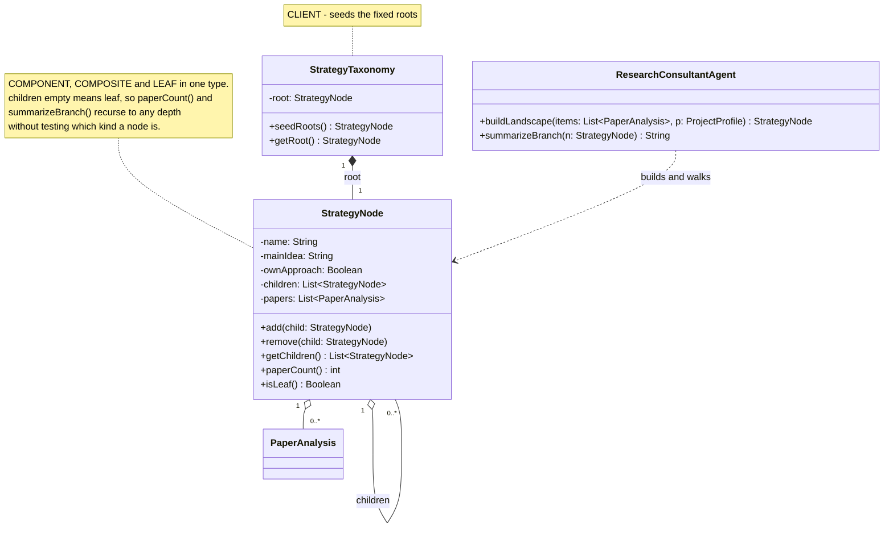
```mermaid
classDiagram
    direction TB
    class StrategyTaxonomy {
        -root: StrategyNode
        +seedRoots() StrategyNode
        +getRoot() StrategyNode
    }
    class StrategyNode {
        -name: String
        -mainIdea: String
        -ownApproach: Boolean
        -children: List~StrategyNode~
        -papers: List~PaperAnalysis~
        +add(child: StrategyNode)
        +remove(child: StrategyNode)
        +getChildren() List~StrategyNode~
        +paperCount() int
        +isLeaf() Boolean
    }
    class PaperAnalysis
    class ResearchConsultantAgent {
        +buildLandscape(items: List~PaperAnalysis~, p: ProjectProfile) StrategyNode
        +summarizeBranch(n: StrategyNode) String
    }
    StrategyTaxonomy "1" *-- "1" StrategyNode : root
    StrategyNode "1" o-- "0..*" StrategyNode : children
    StrategyNode "1" o-- "0..*" PaperAnalysis
    ResearchConsultantAgent ..> StrategyNode : builds and walks
    note for StrategyNode "COMPONENT, COMPOSITE and LEAF in one type.<br/>children empty means leaf, so paperCount() and<br/>summarizeBranch() recurse to any depth<br/>without testing which kind a node is."
    note for StrategyTaxonomy "CLIENT - seeds the fixed roots"
```

*Also available as a [rendered image](diagrams/patterns/pattern-composite.png).*

*Source: `diagrams/patterns/pattern-composite.mmd`*

- **Problem addressed:** the solution landscape is a tree whose depth is not known in
  advance, because the agent proposes sub-branches at runtime. A branch
  ("retrieval-based") and a leaf ("chunk-free retrieval") must be counted, summarised,
  rendered and compared in exactly the same way, even though a branch contains further
  nodes while a leaf contains only papers.
- **Participating classes:** `StrategyNode`, `StrategyTaxonomy`,
  `ResearchConsultantAgent`, `PaperAnalysis`.
- **Roles:** `StrategyNode` is both the component type and the composite — a node whose
  `children` list is empty is simply a leaf, so no separate leaf class is needed.
  `StrategyTaxonomy` seeds the fixed roots and owns the tree. `ResearchConsultantAgent`
  builds and walks it recursively without knowing its depth. `PaperAnalysis` records hang
  off the nodes as the payload.
- **Why appropriate:** recursive operations — `paperCount()`, summarising a branch,
  finding the branch that matches the researcher's own method — are written once and work
  at any depth. The GUI renders the tree with one recursive routine.
- **Without it:** branches and leaves would need separate types, every traversal would
  test which kind it was holding, and a tree one level deeper than planned would force
  changes through the agent and the GUI alike.

## 5. Use-Case Diagram

Source: [`diagrams/use-case-diagram.puml`](diagrams/use-case-diagram.puml).

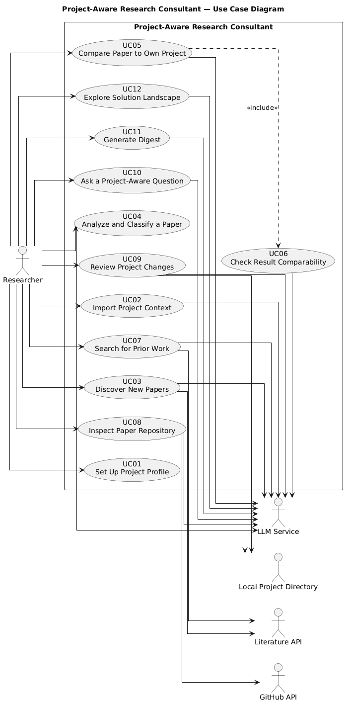

**Actors.** One primary actor and four supporting actors:

| Actor | Kind | Role |
|---|---|---|
| Researcher | Primary (human) | Initiates every use case, through the GUI or the CLI |
| Literature API | External service | arXiv / Semantic Scholar, behind `LiteratureSource` |
| LLM Service | AI service | Claude, behind `LLMClient`; performs all agent reasoning |
| GitHub API | External service | Read-only repository metadata, behind `GitHubClient` |
| Local Project Directory | External resource | The researcher's own project tree, behind `ProjectContextProvider` |

There is no administrator actor: the application is a single-researcher desktop tool with
no accounts, no shared state and no privileged operations, so inventing one would add an
actor that never appears in any scenario.

**Relationships.** Only one `<<include>>` is used — UC05 always runs UC06, because a
comparison that does not establish whether results are comparable is exactly the failure
mode this project exists to prevent. No `<<extend>>` is used. These relationships
were applied only where one genuinely holds: the remaining use cases are independent and
are related only by their preconditions.

**Coverage.** Twelve use cases cover all thirteen features. UC04 covers F04 and F05
(classification is part of analysing a paper), and the remaining use cases map one-to-one.
UC01 is the only use case with no LLM Service association — it is fully deterministic.

## 6. Use-Case Descriptions

### UC01 — Set Up Project Profile
- **Actors:** Researcher.
- **Goal:** Record the research question, datasets, models, metrics and current results so later analysis can be judged against them.
- **Preconditions:** The application is running.
- **Trigger:** The researcher opens the profile editor, or runs the CLI `profile` command.
- **Main success scenario:**
  1. The researcher opens the profile form.
  2. The system shows the stored profile, or an empty form on first use.
  3. The researcher enters the research question, datasets, models, metrics and results.
  4. The researcher saves.
  5. `AppController.saveProfile()` validates the required fields.
  6. `ProjectMemory` persists the profile.
  7. The dashboard shows the updated profile.
- **Alternative / exception flows:**
  - 5a. A required field is empty — the field is flagged inline, nothing is persisted, and the researcher corrects and resubmits.
  - 6a. The write fails — an error is shown and the previously stored profile is left intact.
- **Postconditions:** The profile is in project memory and visible to every agent.
- **Related features:** F01.

### UC02 — Import Project Context
- **Actors:** Researcher; Local Project Directory; LLM Service.
- **Goal:** Load the live state of the researcher's own project into memory.
- **Preconditions:** A profile exists (UC01); a readable local project directory.
- **Trigger:** The researcher chooses "Import project" and picks a directory.
- **Main success scenario:**
  1. The researcher selects a directory.
  2. `AppController.importProjectContext(path)` is called.
  3. `ProjectContextAgent` selects a `ProjectContextProvider`: `ClaudeCodeContextProvider` if a coding agent is available in the target directory, otherwise `FileBasedContextProvider`.
  4. The provider produces a `ContextSnapshot` — by asking the coding agent to describe the project's current state, or by reading code, configuration, result files and Git history directly.
  5. The agent sends the notable items to the LLM Service for a readable summary.
  6. `ProjectMemory` stores the snapshot as the latest.
  7. The imported facts and the summary are displayed, labelled with which provider supplied them.
- **Alternative / exception flows:**
  - 1a. The path is invalid or unreadable — reported, and nothing is stored.
  - 3a. No coding agent is available in the directory — the system falls back to `FileBasedContextProvider` without interrupting the researcher, and the UI says the context is file-derived.
  - 3b. The coding agent is available but times out or returns an unusable description — the same fallback applies, so a failing stretch-goal integration can never block the import.
  - 4a. The directory is not a Git repository — the scan continues and Git-derived facts are marked unavailable rather than failing the import.
  - 5a. The LLM Service is unavailable — the snapshot is still stored and the summary is marked unavailable with a retry offered.
- **Postconditions:** A `ContextSnapshot` is stored as the latest snapshot.
- **Related features:** F02.

### UC03 — Discover New Papers
- **Actors:** Researcher; Literature API; LLM Service.
- **Goal:** Find papers that matter for this specific project.
- **Preconditions:** A profile with a research question exists.
- **Trigger:** The researcher chooses "Discover papers", or runs the CLI `discover` command.
- **Main success scenario:**
  1. The researcher triggers discovery.
  2. `AppController.discoverPapers()` is called.
  3. `PaperDiscoveryAgent` plans search queries from the profile.
  4. `ToolManager.search()` delegates to the selected `LiteratureSource`.
  5. The Literature API returns candidate `PaperRecord`s.
  6. The agent judges relevance against the profile via the LLM Service and ranks the results.
  7. The agent notifies every registered `PaperFeedListener`.
  8. The feed shows the ranked papers with a relevance note each.
- **Alternative / exception flows:**
  - 4a. The Literature API fails or times out — the error is shown with a retry action, and previously discovered papers remain visible.
  - 5a. The search returns nothing — an explicit "no new papers" state is shown rather than a blank feed.
  - 6a. The LLM Service is unavailable — results are shown unranked and clearly labelled as unranked.
- **Postconditions:** Candidate papers are in the feed and listeners have been notified.
- **Related features:** F03.

### UC04 — Analyze and Classify a Paper
- **Actors:** Researcher; LLM Service.
- **Goal:** Turn a paper into a structured record and tag the strategy it uses.
- **Preconditions:** A paper is selected in the feed.
- **Trigger:** The researcher chooses "Analyze" on that paper.
- **Main success scenario:**
  1. The researcher selects a paper and chooses Analyze.
  2. `AppController.analyzePaper(p)` is called.
  3. `PaperAnalysisAgent` obtains the text via `ToolManager.parsePaper()` and `PaperParser`.
  4. The agent extracts problem, method, dataset, model, metrics, results and limitations via the LLM Service.
  5. The agent classifies the strategy using `StrategyTaxonomy.match()`.
  6. The resulting `PaperAnalysis` is stored in `ProjectMemory`.
  7. The detail view shows the structured analysis and its strategy tags.
- **Alternative / exception flows:**
  - 3a. The PDF cannot be parsed — the paper is flagged; analysis falls back to the abstract if one is available, otherwise it stops with a message.
  - 4a. Only some fields can be extracted — the record is still saved, with the missing fields marked unknown.
  - 5a. Classification confidence is low — the tag is marked "uncertain" rather than asserted.
- **Postconditions:** A `PaperAnalysis` is stored and tagged.
- **Related features:** F04, F05.

### UC05 — Compare Paper to Own Project
- **Actors:** Researcher; LLM Service.
- **Goal:** Explain how a paper's approach resembles or differs from the researcher's own work.
- **Preconditions:** The paper has been analysed (UC04) and a profile exists.
- **Trigger:** The researcher chooses "Compare" on an analysed paper.
- **Main success scenario:**
  1. The researcher chooses Compare.
  2. `AppController.comparePaper(a)` is called.
  3. `ResearchConsultantAgent` loads the profile from `ProjectMemory`.
  4. The agent performs UC06 to establish whether the results are comparable (`<<include>>`).
  5. The agent reasons over both structured records via the LLM Service, producing similarities, differences and what is novel.
  6. A `ComparisonResult` is displayed, citing the specific paper fields it drew on.
- **Alternative / exception flows:**
  - 3a. The profile is incomplete — the agent reports exactly which fields are missing instead of guessing.
  - 5a. The LLM Service is unavailable — the deterministic comparability verdict from UC06 is still shown, with the narrative marked unavailable.
- **Postconditions:** A `ComparisonResult` is available for that paper.
- **Related features:** F06.

### UC06 — Check Result Comparability
- **Actors:** Researcher; LLM Service (for the explanation only).
- **Goal:** Decide whether a paper's reported results can fairly be compared with the researcher's own.
- **Preconditions:** A `PaperAnalysis` with dataset, metric and results; a profile with the same.
- **Trigger:** Included by UC05; also re-viewable directly from the comparison view.
- **Main success scenario:**
  1. `ComparabilityChecker.isComparable()` compares dataset, metric and split deterministically.
  2. `ComparabilityChecker.findMismatches()` lists each specific mismatch.
  3. The LLM Service renders the verdict as an explanation in context.
  4. A yes / no / partial badge is shown with that explanation.
- **Alternative / exception flows:**
  - 1a. A field is unknown on either side — the verdict is "cannot determine", never silently treated as a match or a mismatch.
  - 3a. The LLM Service is unavailable — the verdict and the raw mismatch list are shown without the narrative.
- **Postconditions:** The verdict and its note are recorded in the `ComparisonResult`.
- **Related features:** F07.

### UC07 — Search for Prior Work
- **Actors:** Researcher; Literature API; LLM Service.
- **Goal:** Find whether an idea has already been tried.
- **Preconditions:** The application is running; project memory may be empty.
- **Trigger:** The researcher types an idea into the "has anyone tried…" box.
- **Main success scenario:**
  1. The researcher describes an idea in natural language.
  2. `AppController.searchPriorWork(idea)` is called.
  3. The agent searches both the Literature API and the `PaperAnalysis` records already in `ProjectMemory`.
  4. The agent synthesises the closest evidence, with sources and a confidence note.
  5. The findings are displayed.
- **Alternative / exception flows:**
  - 3a. The Literature API fails — results from local memory are still returned, and the gap is stated explicitly.
  - 4a. Nothing matches — reported as "no matching evidence found", explicitly not as "nobody has tried this".
- **Postconditions:** None; this use case only reads.
- **Related features:** F08.

### UC08 — Inspect Paper Repository
- **Actors:** Researcher; GitHub API; LLM Service.
- **Goal:** Judge whether a paper's code exists and is reusable.
- **Preconditions:** The paper record carries a repository URL.
- **Trigger:** The researcher chooses "Check code" on a paper.
- **Main success scenario:**
  1. The researcher chooses Check code.
  2. `AppController.checkRepository(a)` is called.
  3. `RepositoryAnalysisAgent` calls `ToolManager.fetchRepo()`, which uses `GitHubClient` to read repository metadata.
  4. The GitHub API returns `RepoMetadata`.
  5. The agent summarises it via the LLM Service into a `RepoSummary`: code presence, README quality, licence, datasets and evaluation scripts.
  6. The summary is displayed.
- **Alternative / exception flows:**
  - 2a. The paper has no repository URL — reported plainly as "no repository linked".
  - 3a. The repository is private, missing, or the API is rate-limited — reported as inaccessible, with the reason.
  - Throughout: only metadata is read. Repository code is never downloaded and never executed.
- **Postconditions:** A `RepoSummary` is attached to the paper.
- **Related features:** F09.

### UC09 — Review Project Changes
- **Actors:** Researcher; Local Project Directory; LLM Service.
- **Goal:** See what has changed in the researcher's own project since the last check.
- **Preconditions:** At least one prior import (UC02) exists to diff against.
- **Trigger:** The researcher opens the "What changed" panel, or runs the CLI `changes` command.
- **Main success scenario:**
  1. The researcher opens the panel.
  2. `AppController.summarizeProjectChanges()` is called.
  3. `ProjectContextProvider` re-scans the stored project path into a current `ContextSnapshot`.
  4. `ProjectContextAgent` diffs it against `ProjectMemory.getLastSnapshot()`.
  5. The LLM Service summarises the diff in natural language.
  6. The summary is shown and the new snapshot is saved as the latest.
- **Alternative / exception flows:**
  - 2a. No prior snapshot exists — the system says so and points the researcher to UC02 rather than showing an empty panel.
  - 3a. The project path is no longer readable — reported, and the previous snapshot is retained.
  - 4a. Nothing has changed — an explicit "no changes since <date>" is shown.
- **Postconditions:** The latest snapshot is updated.
- **Related features:** F10.

### UC10 — Ask a Project-Aware Question
- **Actors:** Researcher; LLM Service.
- **Goal:** Answer a free-form question using only what is stored about this project.
- **Preconditions:** The application is running; project memory may be partly populated.
- **Trigger:** The researcher sends a message in the chat panel, or runs the CLI `ask` command.
- **Main success scenario:**
  1. The researcher asks a question.
  2. `AppController.ask(question)` is called.
  3. The agent retrieves the relevant records — profile, paper analyses, latest snapshot — from `ProjectMemory`.
  4. The agent answers from that retrieved context via the LLM Service.
  5. The answer is displayed together with references to the records it used.
- **Alternative / exception flows:**
  - 3a. No relevant records are found — the agent says so rather than answering from general knowledge.
  - 4a. The LLM Service is unavailable — an error with a retry is shown; no answer is fabricated.
- **Postconditions:** None; project memory is unchanged.
- **Related features:** F11.

### UC11 — Generate Digest
- **Actors:** Researcher; LLM Service.
- **Goal:** Produce a single summary of new papers and recent project changes.
- **Preconditions:** The application is running.
- **Trigger:** A scheduled run, or the researcher opening the digest view or running the CLI `digest` command.
- **Main success scenario:**
  1. The digest is triggered.
  2. `AppController.buildDigest()` is called.
  3. `DigestBuilder` collects the papers it observed via `PaperFeedListener`, their analyses, and the latest change summary from `ProjectMemory`.
  4. The LLM Service composes the digest text.
  5. The `Digest` is displayed in the GUI, or printed by the CLI.
- **Alternative / exception flows:**
  - 3a. Nothing new since the last digest — an explicit "nothing new since <date>" is shown rather than an empty view.
  - 4a. The LLM Service is unavailable — the assembled digest is still shown, without the narrative summary.
- **Postconditions:** A `Digest` is available in the digest view.
- **Related features:** F12.

### UC12 — Explore Solution Landscape
- **Actors:** Researcher; LLM Service.
- **Goal:** See the space of solution approaches for the project's problem, and where the researcher's own approach sits within it.
- **Preconditions:** A profile exists (UC01) and at least one paper has been analysed (UC04).
- **Trigger:** The researcher opens the "Strategies" view, presses Rebuild, or runs the CLI `landscape` command.
- **Main success scenario:**
  1. The researcher opens the Strategies view.
  2. `AppController.buildSolutionLandscape()` is called.
  3. `ResearchConsultantAgent` loads the stored analyses and the profile from `ProjectMemory`.
  4. `StrategyTaxonomy.seedRoots()` creates the fixed top-level categories.
  5. The agent groups the analyses into proposed sub-branches beneath those roots via the LLM Service.
  6. The agent writes each branch's main idea with `summarizeBranch()`.
  7. The agent flags the branch matching the profile's own method.
  8. `ProjectMemory` stores the landscape and the tree is displayed with the selected branch's detail.
- **Alternative / exception flows:**
  - 3a. Too few analysed papers to derive sub-branches — the seeded roots are shown, with that stated explicitly rather than inventing branches from one or two papers.
  - 5a. A paper matches no branch — it is placed under an explicit "Unclassified" node rather than forced into the nearest one.
  - 6a. The LLM Service is unavailable — the tree is still shown from the fixed roots and the stored strategy tags, with branch summaries marked unavailable.
  - 7a. The profile records no method — the tree is shown without the "your approach" marker and the researcher is prompted to complete the profile.
- **Postconditions:** The landscape is stored as the latest and is reused until rebuilt.
- **Related features:** F13.

## 7. Sequence Diagrams

Nine diagrams cover all thirteen features. A diagram is shared only where features have
the same interaction structure — F02/F10, F04/F05, F06/F07 and F08/F11 are merged on that
basis, while everything else is separate.

Every diagram runs the full chain from the actor through `MainGUI` and `AppController` to
an agent, `ToolManager` and the external tool, with return values and activation bars
shown. Each carries at least one `alt` fragment for the failure its feature specification
names. All participants and messages use classes and methods declared in the class diagram
in section 3.

| Diagram | Features | Use cases | What it demonstrates |
|---|---|---|---|
| SD01 | F01 | UC01 | Deterministic path, no agent |
| SD02 | F02, F10 | UC02, UC09 | Adapter with runtime fallback |
| SD03 | F03 | UC03 | Strategy + Observer broadcast |
| SD04 | F04, F05 | UC04 | Template Method |
| SD05 | F06, F07 | UC05, UC06 | Deterministic check, AI narration |
| SD06 | F08, F11 | UC07, UC10 | Retrieval grounding |
| SD07 | F09 | UC08 | External API failure handling |
| SD08 | F12 | UC11 | Observer consumer side |
| SD09 | F13 | UC12 | Composite recursion |

### SD01 — Set Up Project Profile

*Features F01 · Use cases UC01. Source: `diagrams/sd01-profile-setup.mmd`*

The only flow with no agent and no LLM. It is included to show that the deterministic path through the facade is real: validation happens in `AppController`, persistence in `ProjectMemory`, and a validation failure stores nothing.

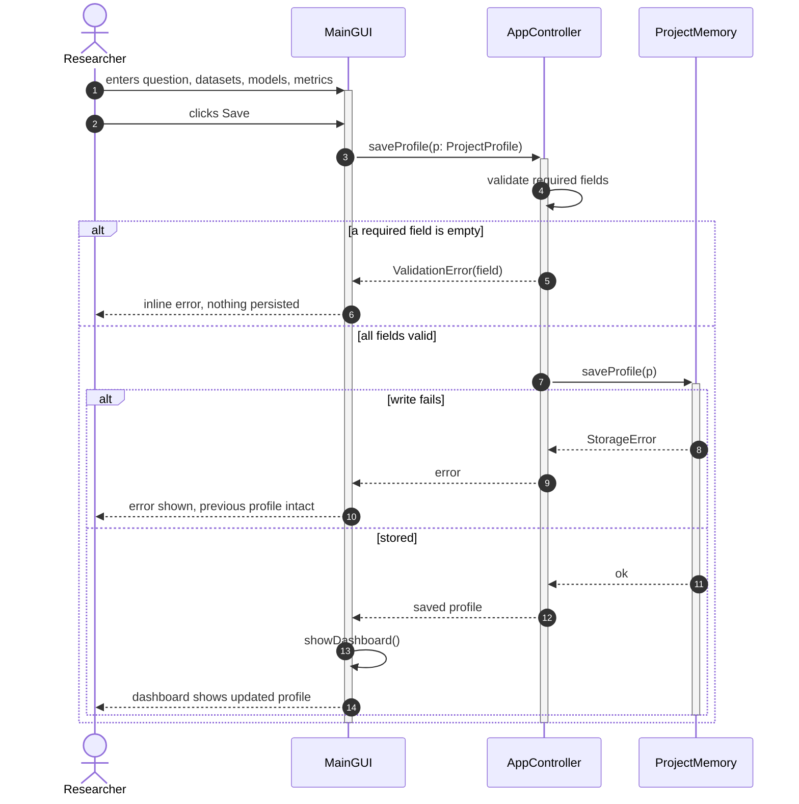
```mermaid
sequenceDiagram
    autonumber
    actor R as Researcher
    participant GUI as MainGUI
    participant C as AppController
    participant M as ProjectMemory

    R->>+GUI: enters question, datasets, models, metrics
    R->>GUI: clicks Save
    GUI->>+C: saveProfile(p: ProjectProfile)
    C->>C: validate required fields
    alt a required field is empty
        C-->>GUI: ValidationError(field)
        GUI-->>R: inline error, nothing persisted
    else all fields valid
        C->>+M: saveProfile(p)
        alt write fails
            M-->>C: StorageError
            C-->>GUI: error
            GUI-->>R: error shown, previous profile intact
        else stored
            M-->>C: ok
            C-->>GUI: saved profile
            GUI->>GUI: showDashboard()
            GUI-->>R: dashboard shows updated profile
        end
        deactivate M
    end
    deactivate C
    deactivate GUI
```

*Also available as a [rendered image](diagrams/sd01-profile-setup.png).*

### SD02 — Import Project Context and Review Changes

*Features F02, F10 · Use cases UC02, UC09. Source: `diagrams/sd02-project-context.mmd`*

F10 is F02 plus a diff, so they share one diagram. The first half shows runtime provider selection — `ClaudeCodeContextProvider` is probed first and the system falls back to `FileBasedContextProvider` without interrupting the researcher. The second half re-scans and diffs against the stored snapshot.

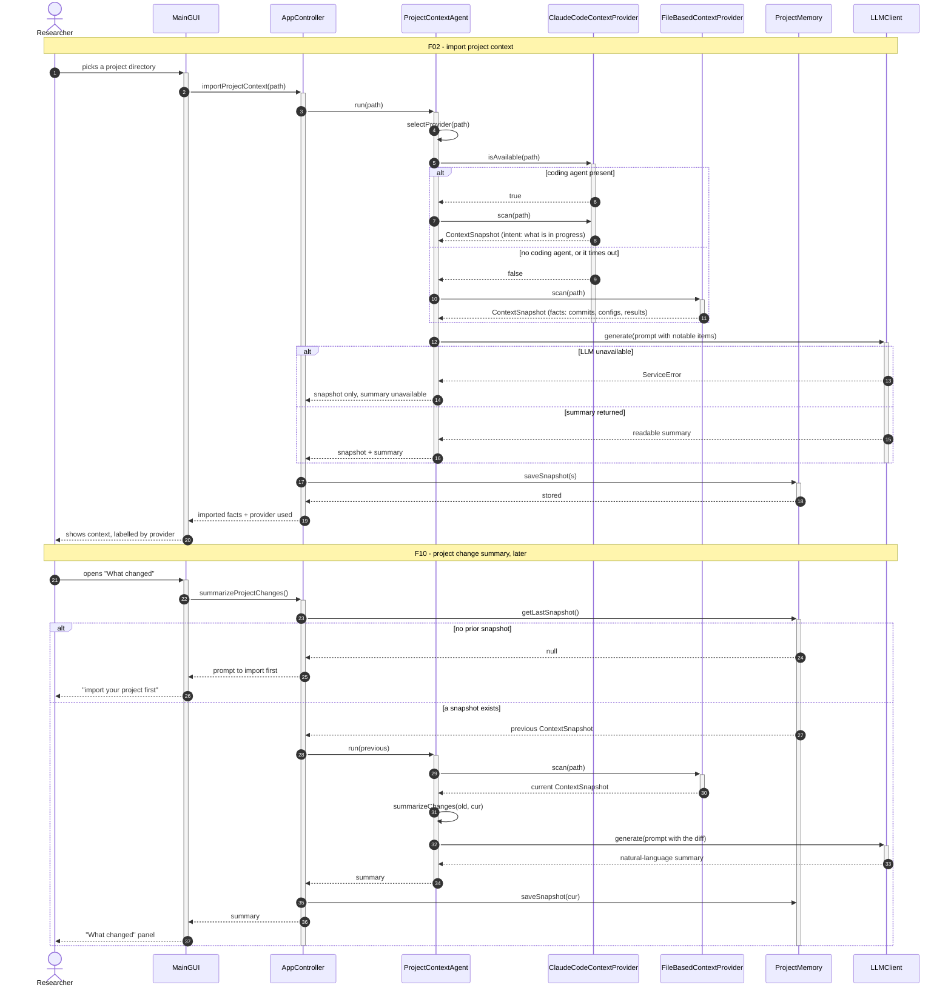
```mermaid
sequenceDiagram
    autonumber
    actor R as Researcher
    participant GUI as MainGUI
    participant C as AppController
    participant A as ProjectContextAgent
    participant CC as ClaudeCodeContextProvider
    participant FB as FileBasedContextProvider
    participant M as ProjectMemory
    participant L as LLMClient

    Note over R,L: F02 - import project context
    R->>+GUI: picks a project directory
    GUI->>+C: importProjectContext(path)
    C->>+A: run(path)
    A->>A: selectProvider(path)
    A->>+CC: isAvailable(path)
    alt coding agent present
        CC-->>A: true
        A->>CC: scan(path)
        CC-->>A: ContextSnapshot (intent: what is in progress)
    else no coding agent, or it times out
        CC-->>A: false
        A->>+FB: scan(path)
        FB-->>A: ContextSnapshot (facts: commits, configs, results)
        deactivate FB
    end
    deactivate CC
    A->>+L: generate(prompt with notable items)
    alt LLM unavailable
        L-->>A: ServiceError
        A-->>C: snapshot only, summary unavailable
    else summary returned
        L-->>A: readable summary
        A-->>C: snapshot + summary
    end
    deactivate L
    deactivate A
    C->>+M: saveSnapshot(s)
    M-->>-C: stored
    C-->>GUI: imported facts + provider used
    deactivate C
    GUI-->>R: shows context, labelled by provider
    deactivate GUI

    Note over R,L: F10 - project change summary, later
    R->>+GUI: opens "What changed"
    GUI->>+C: summarizeProjectChanges()
    C->>+M: getLastSnapshot()
    alt no prior snapshot
        M-->>C: null
        C-->>GUI: prompt to import first
        GUI-->>R: "import your project first"
    else a snapshot exists
        M-->>C: previous ContextSnapshot
        C->>+A: run(previous)
        A->>+FB: scan(path)
        FB-->>-A: current ContextSnapshot
        A->>A: summarizeChanges(old, cur)
        A->>+L: generate(prompt with the diff)
        L-->>-A: natural-language summary
        A-->>-C: summary
        C->>M: saveSnapshot(cur)
        C-->>GUI: summary
        GUI-->>R: "What changed" panel
    end
    deactivate M
    deactivate C
    deactivate GUI
```

*Also available as a [rendered image](diagrams/sd02-project-context.png).*

### SD03 — Discover New Papers

*Features F03 · Use cases UC03. Source: `diagrams/sd03-discover-papers.mmd`*

The only flow containing a broadcast. After ranking, `notifyListeners()` fans out to `PaperFeedPanel` and `DigestBuilder` independently — the Observer pattern, which a linear call chain cannot express. Also shows the Strategy choice of literature source.

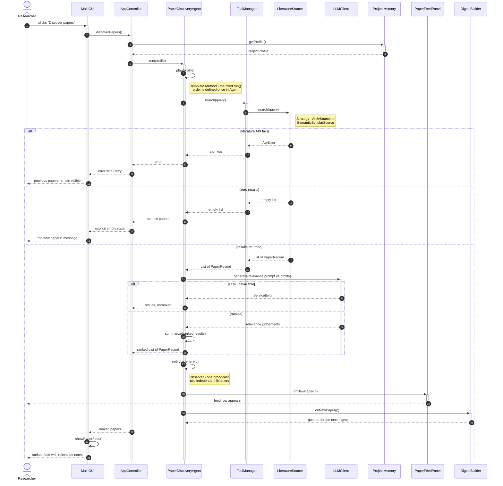
```mermaid
sequenceDiagram
    autonumber
    actor R as Researcher
    participant GUI as MainGUI
    participant C as AppController
    participant A as PaperDiscoveryAgent
    participant T as ToolManager
    participant S as LiteratureSource
    participant L as LLMClient
    participant M as ProjectMemory
    participant FP as PaperFeedPanel
    participant DB as DigestBuilder

    R->>+GUI: clicks "Discover papers"
    GUI->>+C: discoverPapers()
    C->>+M: getProfile()
    M-->>-C: ProjectProfile
    C->>+A: run(profile)
    A->>A: plan(profile)
    Note right of A: Template Method - the fixed run()<br/>order is defined once in Agent
    A->>+T: search(query)
    T->>+S: search(query)
    Note right of S: Strategy - ArxivSource or<br/>SemanticScholarSource
    alt literature API fails
        S-->>T: ApiError
        T-->>A: ApiError
        A-->>C: error
        C-->>GUI: error with Retry
        GUI-->>R: previous papers remain visible
    else zero results
        S-->>T: empty list
        T-->>A: empty list
        A-->>C: no new papers
        C-->>GUI: explicit empty state
        GUI-->>R: "no new papers" message
    else results returned
        S-->>T: List of PaperRecord
        T-->>A: List of PaperRecord
        A->>+L: generate(relevance prompt vs profile)
        alt LLM unavailable
            L-->>A: ServiceError
            A-->>C: results, unranked
        else ranked
            L-->>A: relevance judgements
            A->>A: summarize(ranked results)
            A-->>C: ranked List of PaperRecord
        end
        deactivate L
        A->>A: notifyListeners(p)
        Note right of A: Observer - one broadcast,<br/>two independent listeners
        A->>+FP: onNewPaper(p)
        FP-->>-R: feed row appears
        A->>+DB: onNewPaper(p)
        DB-->>-A: queued for the next digest
        C-->>GUI: ranked papers
        GUI->>GUI: showPaperFeed()
        GUI-->>R: ranked feed with relevance notes
    end
    deactivate S
    deactivate T
    deactivate A
    deactivate C
    deactivate GUI
```

*Also available as a [rendered image](diagrams/sd03-discover-papers.png).*

### SD04 — Analyze and Classify a Paper

*Features F04, F05 · Use cases UC04. Source: `diagrams/sd04-analyze-classify.mmd`*

Classification is the final step of analysis rather than a separate interaction, so both features share a diagram. This is where the Template Method is visible: `plan()`, tool use, then `summarize()`, with the fixed order defined once in `Agent`.

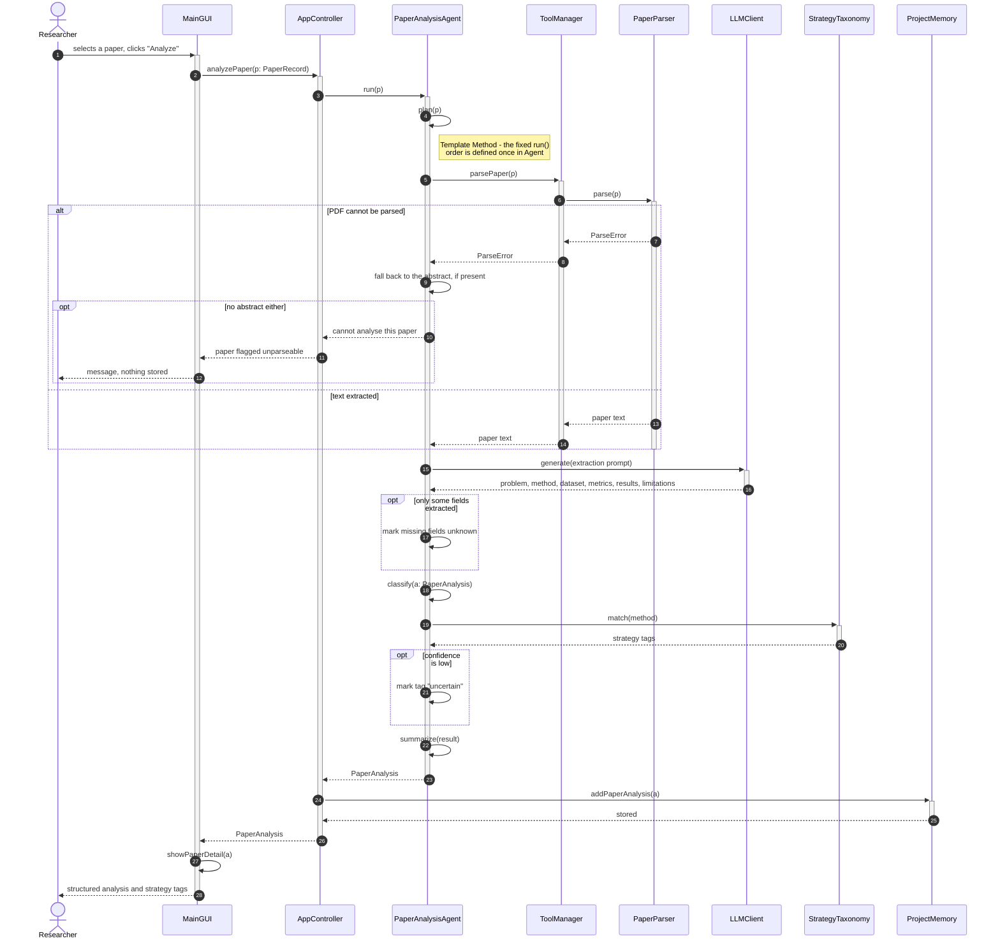
```mermaid
sequenceDiagram
    autonumber
    actor R as Researcher
    participant GUI as MainGUI
    participant C as AppController
    participant A as PaperAnalysisAgent
    participant T as ToolManager
    participant P as PaperParser
    participant L as LLMClient
    participant TX as StrategyTaxonomy
    participant M as ProjectMemory

    R->>+GUI: selects a paper, clicks "Analyze"
    GUI->>+C: analyzePaper(p: PaperRecord)
    C->>+A: run(p)
    A->>A: plan(p)
    Note right of A: Template Method - the fixed run()<br/>order is defined once in Agent
    A->>+T: parsePaper(p)
    T->>+P: parse(p)
    alt PDF cannot be parsed
        P-->>T: ParseError
        T-->>A: ParseError
        A->>A: fall back to the abstract, if present
        opt no abstract either
            A-->>C: cannot analyse this paper
            C-->>GUI: paper flagged unparseable
            GUI-->>R: message, nothing stored
        end
    else text extracted
        P-->>T: paper text
        T-->>A: paper text
    end
    deactivate P
    deactivate T
    A->>+L: generate(extraction prompt)
    L-->>-A: problem, method, dataset, metrics, results, limitations
    opt only some fields extracted
        A->>A: mark missing fields unknown
    end
    A->>A: classify(a: PaperAnalysis)
    A->>+TX: match(method)
    TX-->>-A: strategy tags
    opt confidence is low
        A->>A: mark tag "uncertain"
    end
    A->>A: summarize(result)
    A-->>-C: PaperAnalysis
    C->>+M: addPaperAnalysis(a)
    M-->>-C: stored
    C-->>-GUI: PaperAnalysis
    GUI->>GUI: showPaperDetail(a)
    GUI-->>-R: structured analysis and strategy tags
```

*Also available as a [rendered image](diagrams/sd04-analyze-classify.png).*

### SD05 — Compare and Check Comparability

*Features F06, F07 · Use cases UC05, UC06. Source: `diagrams/sd05-compare-comparability.mmd`*

The `<<include>>` from UC05 to UC06 made concrete. `ComparabilityChecker` is called synchronously and decides the verdict with no LLM involved; the LLM only narrates the result afterwards. The hybrid seam is visible in the diagram rather than asserted in prose.

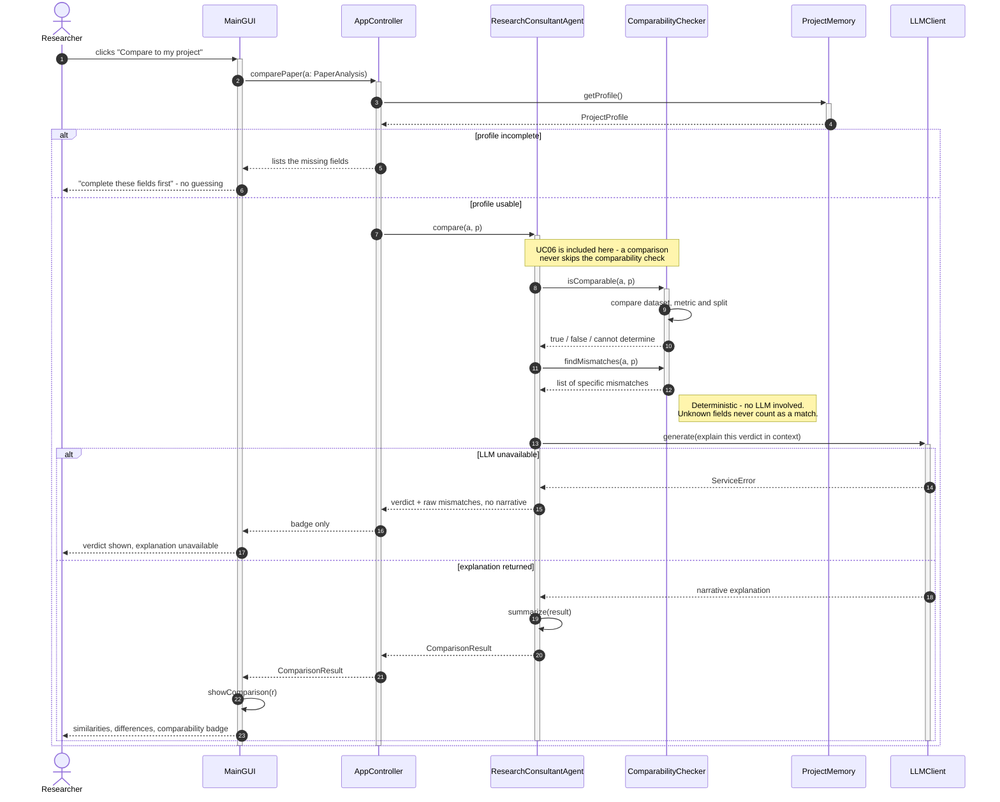
```mermaid
sequenceDiagram
    autonumber
    actor R as Researcher
    participant GUI as MainGUI
    participant C as AppController
    participant A as ResearchConsultantAgent
    participant K as ComparabilityChecker
    participant M as ProjectMemory
    participant L as LLMClient

    R->>+GUI: clicks "Compare to my project"
    GUI->>+C: comparePaper(a: PaperAnalysis)
    C->>+M: getProfile()
    M-->>-C: ProjectProfile
    alt profile incomplete
        C-->>GUI: lists the missing fields
        GUI-->>R: "complete these fields first" - no guessing
    else profile usable
        C->>+A: compare(a, p)
        Note over A,K: UC06 is included here - a comparison<br/>never skips the comparability check
        A->>+K: isComparable(a, p)
        K->>K: compare dataset, metric and split
        K-->>A: true / false / cannot determine
        A->>K: findMismatches(a, p)
        K-->>-A: list of specific mismatches
        Note right of K: Deterministic - no LLM involved.<br/>Unknown fields never count as a match.
        A->>+L: generate(explain this verdict in context)
        alt LLM unavailable
            L-->>A: ServiceError
            A-->>C: verdict + raw mismatches, no narrative
            C-->>GUI: badge only
            GUI-->>R: verdict shown, explanation unavailable
        else explanation returned
            L-->>A: narrative explanation
            A->>A: summarize(result)
            A-->>C: ComparisonResult
            C-->>GUI: ComparisonResult
            GUI->>GUI: showComparison(r)
            GUI-->>R: similarities, differences, comparability badge
        end
        deactivate L
        deactivate A
    end
    deactivate C
    deactivate GUI
```

*Also available as a [rendered image](diagrams/sd05-compare-comparability.png).*

### SD06 — Grounded Answering

*Features F08, F11 · Use cases UC07, UC10. Source: `diagrams/sd06-grounded-answering.mmd`*

Both features retrieve from project memory first and answer only from what was retrieved; F08 additionally queries the literature API, shown as an optional fragment. The failure branch is the important one: with nothing relevant retrieved the agent says so instead of answering from general knowledge.

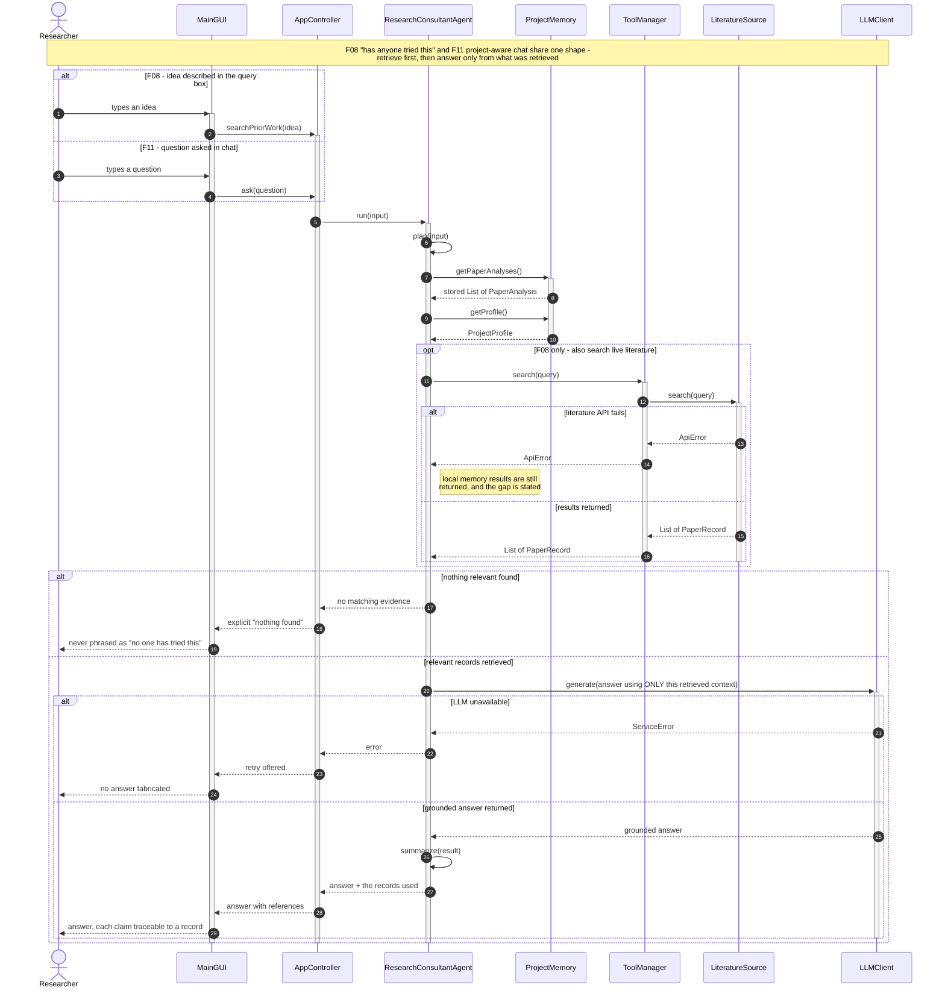
```mermaid
sequenceDiagram
    autonumber
    actor R as Researcher
    participant GUI as MainGUI
    participant C as AppController
    participant A as ResearchConsultantAgent
    participant M as ProjectMemory
    participant T as ToolManager
    participant S as LiteratureSource
    participant L as LLMClient

    Note over R,L: F08 "has anyone tried this" and F11 project-aware chat share one shape -<br/>retrieve first, then answer only from what was retrieved
    alt F08 - idea described in the query box
        R->>+GUI: types an idea
        GUI->>+C: searchPriorWork(idea)
    else F11 - question asked in chat
        R->>GUI: types a question
        GUI->>C: ask(question)
    end
    C->>+A: run(input)
    A->>A: plan(input)
    A->>+M: getPaperAnalyses()
    M-->>A: stored List of PaperAnalysis
    A->>M: getProfile()
    M-->>-A: ProjectProfile
    opt F08 only - also search live literature
        A->>+T: search(query)
        T->>+S: search(query)
        alt literature API fails
            S-->>T: ApiError
            T-->>A: ApiError
            Note right of A: local memory results are still<br/>returned, and the gap is stated
        else results returned
            S-->>T: List of PaperRecord
            T-->>A: List of PaperRecord
        end
        deactivate S
        deactivate T
    end
    alt nothing relevant found
        A-->>C: no matching evidence
        C-->>GUI: explicit "nothing found"
        GUI-->>R: never phrased as "no one has tried this"
    else relevant records retrieved
        A->>+L: generate(answer using ONLY this retrieved context)
        alt LLM unavailable
            L-->>A: ServiceError
            A-->>C: error
            C-->>GUI: retry offered
            GUI-->>R: no answer fabricated
        else grounded answer returned
            L-->>A: grounded answer
            A->>A: summarize(result)
            A-->>C: answer + the records used
            C-->>GUI: answer with references
            GUI-->>R: answer, each claim traceable to a record
        end
        deactivate L
    end
    deactivate A
    deactivate C
    deactivate GUI
```

*Also available as a [rendered image](diagrams/sd06-grounded-answering.png).*

### SD07 — Repository Analysis

*Features F09 · Use cases UC08. Source: `diagrams/sd07-repository-analysis.mmd`*

The only flow reaching GitHub, and the one with the richest error handling — no URL, private, missing, and rate-limited are all distinct branches. The diagram also records the standing constraint that only metadata is read and repository code is never executed.

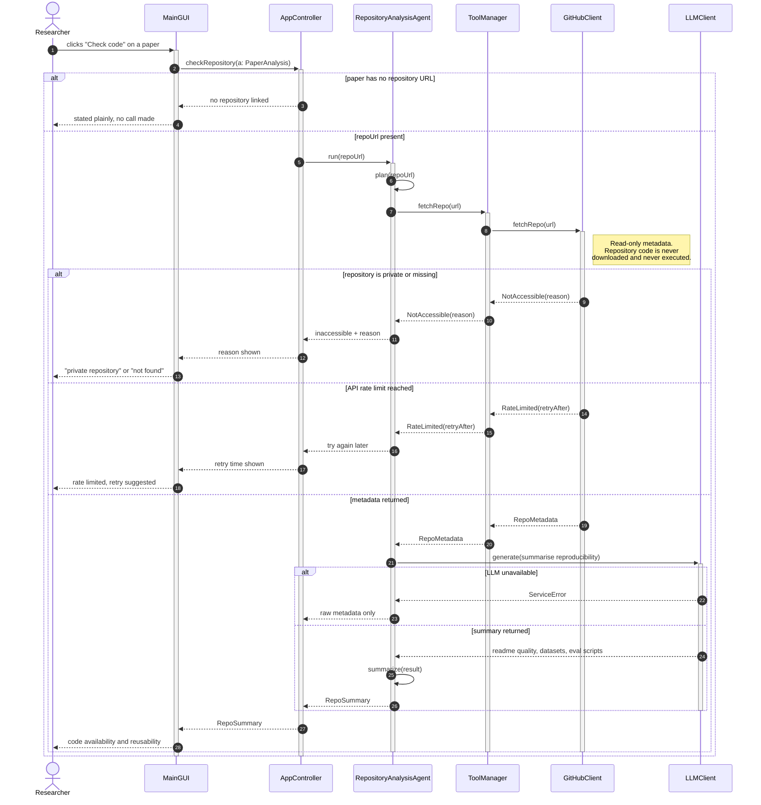
```mermaid
sequenceDiagram
    autonumber
    actor R as Researcher
    participant GUI as MainGUI
    participant C as AppController
    participant A as RepositoryAnalysisAgent
    participant T as ToolManager
    participant G as GitHubClient
    participant L as LLMClient

    R->>+GUI: clicks "Check code" on a paper
    GUI->>+C: checkRepository(a: PaperAnalysis)
    alt paper has no repository URL
        C-->>GUI: no repository linked
        GUI-->>R: stated plainly, no call made
    else repoUrl present
        C->>+A: run(repoUrl)
        A->>A: plan(repoUrl)
        A->>+T: fetchRepo(url)
        T->>+G: fetchRepo(url)
        Note right of G: Read-only metadata.<br/>Repository code is never<br/>downloaded and never executed.
        alt repository is private or missing
            G-->>T: NotAccessible(reason)
            T-->>A: NotAccessible(reason)
            A-->>C: inaccessible + reason
            C-->>GUI: reason shown
            GUI-->>R: "private repository" or "not found"
        else API rate limit reached
            G-->>T: RateLimited(retryAfter)
            T-->>A: RateLimited(retryAfter)
            A-->>C: try again later
            C-->>GUI: retry time shown
            GUI-->>R: rate limited, retry suggested
        else metadata returned
            G-->>T: RepoMetadata
            T-->>A: RepoMetadata
            A->>+L: generate(summarise reproducibility)
            alt LLM unavailable
                L-->>A: ServiceError
                A-->>C: raw metadata only
            else summary returned
                L-->>A: readme quality, datasets, eval scripts
                A->>A: summarize(result)
                A-->>C: RepoSummary
            end
            deactivate L
            C-->>GUI: RepoSummary
            GUI-->>R: code availability and reusability
        end
        deactivate G
        deactivate T
        deactivate A
    end
    deactivate C
    deactivate GUI
```

*Also available as a [rendered image](diagrams/sd07-repository-analysis.png).*

### SD08 — Generate Digest

*Features F12 · Use cases UC11. Source: `diagrams/sd08-digest.mmd`*

Shows the consumer side of the Observer in SD03: `DigestBuilder` has been accumulating papers since the last digest rather than querying for them. Can be triggered on a schedule with no user action, and reports an empty digest explicitly.

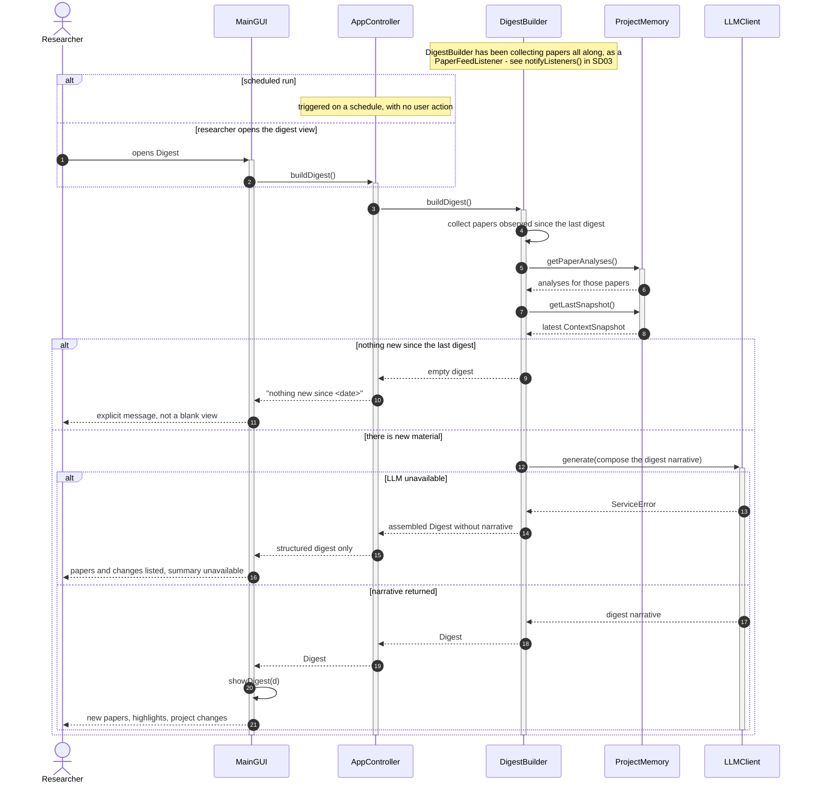
```mermaid
sequenceDiagram
    autonumber
    actor R as Researcher
    participant GUI as MainGUI
    participant C as AppController
    participant DB as DigestBuilder
    participant M as ProjectMemory
    participant L as LLMClient

    Note over DB: DigestBuilder has been collecting papers all along, as a<br/>PaperFeedListener - see notifyListeners() in SD03
    alt scheduled run
        Note over C: triggered on a schedule, with no user action
    else researcher opens the digest view
        R->>+GUI: opens Digest
        GUI->>+C: buildDigest()
    end
    C->>+DB: buildDigest()
    DB->>DB: collect papers observed since the last digest
    DB->>+M: getPaperAnalyses()
    M-->>DB: analyses for those papers
    DB->>M: getLastSnapshot()
    M-->>-DB: latest ContextSnapshot
    alt nothing new since the last digest
        DB-->>C: empty digest
        C-->>GUI: "nothing new since <date>"
        GUI-->>R: explicit message, not a blank view
    else there is new material
        DB->>+L: generate(compose the digest narrative)
        alt LLM unavailable
            L-->>DB: ServiceError
            DB-->>C: assembled Digest without narrative
            C-->>GUI: structured digest only
            GUI-->>R: papers and changes listed, summary unavailable
        else narrative returned
            L-->>DB: digest narrative
            DB-->>C: Digest
            C-->>GUI: Digest
            GUI->>GUI: showDigest(d)
            GUI-->>R: new papers, highlights, project changes
        end
        deactivate L
    end
    deactivate DB
    deactivate C
    deactivate GUI
```

*Also available as a [rendered image](diagrams/sd08-digest.png).*

### SD09 — Build Solution Landscape

*Features F13 · Use cases UC12. Source: `diagrams/sd09-solution-landscape.mmd`*

Kept separate from SD08 because its middle differs entirely: a recursive walk over `StrategyNode`. This is the Composite pattern at runtime — one loop handles every depth because a branch and a leaf are the same type. The deterministic seed and the agent's proposals are also clearly divided.

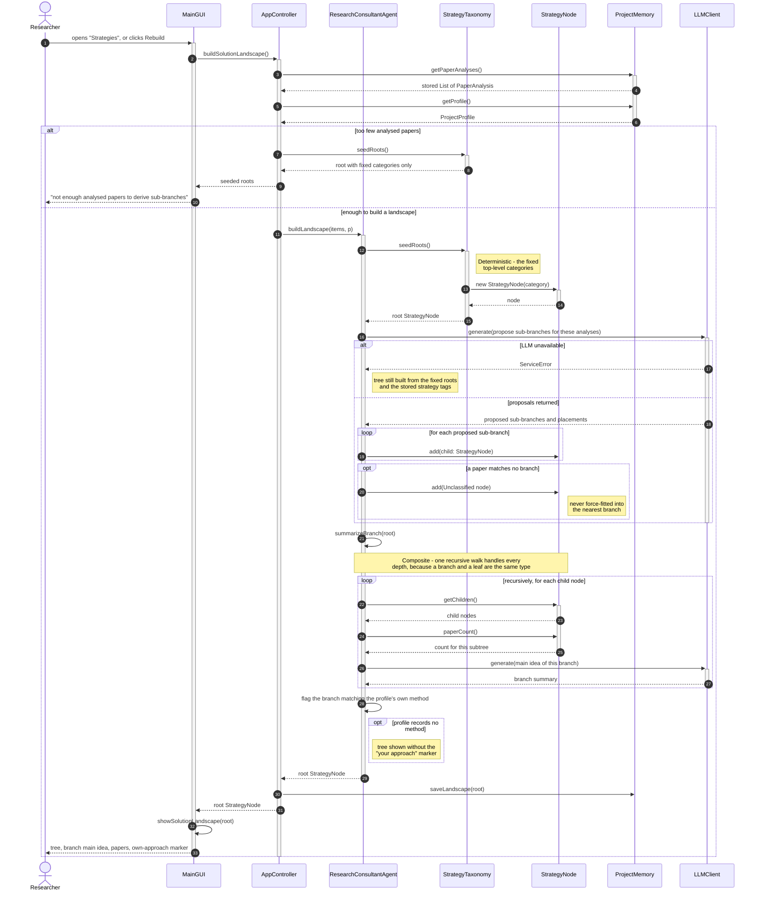
```mermaid
sequenceDiagram
    autonumber
    actor R as Researcher
    participant GUI as MainGUI
    participant C as AppController
    participant A as ResearchConsultantAgent
    participant TX as StrategyTaxonomy
    participant N as StrategyNode
    participant M as ProjectMemory
    participant L as LLMClient

    R->>+GUI: opens "Strategies", or clicks Rebuild
    GUI->>+C: buildSolutionLandscape()
    C->>+M: getPaperAnalyses()
    M-->>C: stored List of PaperAnalysis
    C->>M: getProfile()
    M-->>-C: ProjectProfile
    alt too few analysed papers
        C->>+TX: seedRoots()
        TX-->>-C: root with fixed categories only
        C-->>GUI: seeded roots
        GUI-->>R: "not enough analysed papers to derive sub-branches"
    else enough to build a landscape
        C->>+A: buildLandscape(items, p)
        A->>+TX: seedRoots()
        Note right of TX: Deterministic - the fixed<br/>top-level categories
        TX->>+N: new StrategyNode(category)
        N-->>-TX: node
        TX-->>-A: root StrategyNode
        A->>+L: generate(propose sub-branches for these analyses)
        alt LLM unavailable
            L-->>A: ServiceError
            Note right of A: tree still built from the fixed roots<br/>and the stored strategy tags
        else proposals returned
            L-->>A: proposed sub-branches and placements
            loop for each proposed sub-branch
                A->>N: add(child: StrategyNode)
            end
            opt a paper matches no branch
                A->>N: add(Unclassified node)
                Note right of N: never force-fitted into<br/>the nearest branch
            end
        end
        deactivate L
        A->>A: summarizeBranch(root)
        Note over A,N: Composite - one recursive walk handles every<br/>depth, because a branch and a leaf are the same type
        loop recursively, for each child node
            A->>+N: getChildren()
            N-->>A: child nodes
            A->>N: paperCount()
            N-->>-A: count for this subtree
            A->>+L: generate(main idea of this branch)
            L-->>-A: branch summary
        end
        A->>A: flag the branch matching the profile's own method
        opt profile records no method
            Note right of A: tree shown without the<br/>"your approach" marker
        end
        A-->>-C: root StrategyNode
        C->>M: saveLandscape(root)
        C-->>GUI: root StrategyNode
        GUI->>GUI: showSolutionLandscape(root)
        GUI-->>R: tree, branch main idea, papers, own-approach marker
    end
    deactivate C
    deactivate GUI
```

*Also available as a [rendered image](diagrams/sd09-solution-landscape.png).*

## 8. Feature-to-Design Traceability

Every feature in section 2 is traced to the use case that describes it, the classes and
methods that implement it, the sequence diagram that shows it at runtime, and the design
patterns it relies on. All class and method names below are declared in the class diagram
in section 3.

Two patterns recur in almost every row, and that is a property of the architecture rather
than padding: every feature enters through the Facade (`AppController`), and every feature
that touches project state reads the Singleton (`ProjectMemory`). The remaining pattern in
each row is the one that actually shapes that feature.

| Feature | Description | Type | Use case | Classes | Key methods | Seq. | Patterns |
|---|---|---|---|---|---|---|---|
| **F01** | Project profile setup | Deterministic | UC01 | `MainGUI`, `CLI`, `AppController`, `ProjectProfile`, `ProjectMemory` | `saveProfile()`, `getProfile()`, `showDashboard()` | SD01 | Facade, Singleton |
| **F02** | Import project context | Hybrid | UC02 | `AppController`, `ProjectContextAgent`, `ProjectContextProvider`, `ClaudeCodeContextProvider`, `FileBasedContextProvider`, `ContextSnapshot`, `ProjectMemory`, `LLMClient` | `importProjectContext()`, `selectProvider()`, `isAvailable()`, `scan()`, `saveSnapshot()` | SD02 | **Adapter**, Template Method, Facade |
| **F03** | Discover new papers | AI | UC03 | `AppController`, `PaperDiscoveryAgent`, `ToolManager`, `LiteratureSource`, `ArxivSource`, `SemanticScholarSource`, `LLMClient`, `PaperFeedListener`, `PaperFeedPanel`, `DigestBuilder`, `PaperRecord` | `discoverPapers()`, `run()`, `search()`, `setLiteratureSource()`, `notifyListeners()`, `onNewPaper()` | SD03 | **Strategy**, **Observer**, Template Method, Facade |
| **F04** | Analyze a paper | AI | UC04 | `AppController`, `PaperAnalysisAgent`, `ToolManager`, `PaperParser`, `LLMClient`, `PaperAnalysis`, `ProjectMemory` | `analyzePaper()`, `plan()`, `parsePaper()`, `parse()`, `generate()`, `addPaperAnalysis()` | SD04 | **Template Method**, Adapter, Facade |
| **F05** | Classify paper by strategy | AI | UC04 | `PaperAnalysisAgent`, `StrategyTaxonomy`, `PaperAnalysis` | `classifyPaper()`, `classify()`, `match()`, `isKnown()` | SD04 | Template Method, Facade |
| **F06** | Compare paper to own project | AI | UC05 | `AppController`, `ResearchConsultantAgent`, `ProjectMemory`, `ProjectProfile`, `PaperAnalysis`, `ComparisonResult`, `LLMClient` | `comparePaper()`, `compare()`, `getProfile()`, `generate()`, `summarize()` | SD05 | Template Method, Facade, Singleton |
| **F07** | Comparability check | Hybrid | UC06 | `ResearchConsultantAgent`, `ComparabilityChecker`, `PaperAnalysis`, `ProjectProfile`, `ComparisonResult` | `isComparable()`, `findMismatches()` | SD05 | Facade *(deterministic domain service — introduces no pattern of its own, by design)* |
| **F08** | "Has anyone tried this" search | AI | UC07 | `AppController`, `ResearchConsultantAgent`, `ProjectMemory`, `ToolManager`, `LiteratureSource`, `PaperAnalysis`, `LLMClient` | `searchPriorWork()`, `getPaperAnalyses()`, `search()`, `generate()` | SD06 | Strategy, Facade, Singleton |
| **F09** | Repository analysis | Hybrid | UC08 | `AppController`, `RepositoryAnalysisAgent`, `ToolManager`, `GitHubClient`, `RepoMetadata`, `RepoSummary`, `LLMClient` | `checkRepository()`, `fetchRepo()`, `generate()`, `summarize()` | SD07 | Template Method, Adapter, Facade |
| **F10** | Project change summary | Hybrid | UC09 | `AppController`, `ProjectContextAgent`, `ProjectContextProvider`, `ContextSnapshot`, `ProjectMemory`, `LLMClient` | `summarizeProjectChanges()`, `getLastSnapshot()`, `scan()`, `summarizeChanges()`, `saveSnapshot()` | SD02 | Adapter, Facade, Singleton |
| **F11** | Project-aware chat | AI | UC10 | `AppController`, `ResearchConsultantAgent`, `ProjectMemory`, `ProjectProfile`, `PaperAnalysis`, `LLMClient` | `ask()`, `getPaperAnalyses()`, `getProfile()`, `generate()` | SD06 | Template Method, Facade, Singleton |
| **F12** | Weekly digest | Hybrid | UC11 | `AppController`, `DigestBuilder`, `PaperFeedListener`, `ProjectMemory`, `Digest`, `PaperRecord`, `LLMClient` | `buildDigest()`, `onNewPaper()`, `getPaperAnalyses()`, `getLastSnapshot()`, `showDigest()` | SD08 | **Observer**, Facade, Singleton |
| **F13** | Solution landscape | Hybrid | UC12 | `AppController`, `ResearchConsultantAgent`, `StrategyTaxonomy`, `StrategyNode`, `PaperAnalysis`, `ProjectMemory`, `LLMClient` | `buildSolutionLandscape()`, `seedRoots()`, `buildLandscape()`, `summarizeBranch()`, `getChildren()`, `paperCount()`, `isLeaf()`, `saveLandscape()` | SD09 | **Composite**, Facade, Singleton |

### Coverage checks

- **Every feature is traceable.** All 13 features map to a use case, a set of classes, named methods, a sequence diagram and at least one pattern. No feature exists only in the project description.
- **Every use case is reached.** UC01–UC12 all appear in the table. UC04 carries two features (F04 analysis and F05 classification) and UC05/UC06 split F06 and F07, matching the `<<include>>` in section 5.
- **Every sequence diagram is used.** SD01–SD09 all appear. SD02, SD04, SD05 and SD06 each serve two features, which is why nine diagrams cover thirteen features.
- **Every pattern earns its place.** Each of the seven patterns in section 4 appears in at least one row, and each is the *shaping* pattern (shown in bold) for at least one feature — Adapter for F02, Strategy and Observer for F03, Template Method for F04, Observer for F12, Composite for F13.

## 9. How Each Feature Is Realized

For each feature: the use case that describes it, the sequence diagram that shows it, the
classes with their responsibility in that feature, the methods that carry it, and how they
collaborate at runtime.

### F01 — Project Profile Setup
**Use case:** UC01 · **Sequence diagram:** SD01

**Classes involved**
- `MainGUI` — presents the profile form and reports validation errors inline.
- `CLI` — offers the same operation non-graphically.
- `AppController` — validates the submitted fields; the single entry point for the feature.
- `ProjectProfile` — holds research question, datasets, models, metrics and own results.
- `ProjectMemory` — persists the profile as the one shared copy.

**Important methods**
`AppController.saveProfile()` · `ProjectMemory.saveProfile()` · `ProjectMemory.getProfile()` · `MainGUI.showDashboard()`

**Execution.** The researcher fills the form and saves. `MainGUI` hands the populated
`ProjectProfile` to `AppController.saveProfile()`, which checks the required fields. If any
is empty the controller returns a validation error and **nothing is written** — the previous
profile stays intact. Otherwise the profile is passed to `ProjectMemory.saveProfile()`, and
`showDashboard()` redisplays it. Because `ProjectMemory` is a singleton, every agent and the
CLI see the new profile immediately, with no synchronisation step. This is the only feature
that touches no agent and no LLM.

### F02 — Import Project Context
**Use case:** UC02 · **Sequence diagram:** SD02

**Classes involved**
- `AppController` — receives the chosen directory path.
- `ProjectContextAgent` — decides which provider to use and summarises the result.
- `ProjectContextProvider` — the interface both providers satisfy.
- `ClaudeCodeContextProvider` — delegates to a coding agent working in that directory, yielding *intent*.
- `FileBasedContextProvider` — reads Git history, configs and result files directly, yielding *facts*.
- `ContextSnapshot` — the uniform result either provider returns.
- `LLMClient`, `ProjectMemory` — narration and storage.

**Important methods**
`AppController.importProjectContext()` · `ProjectContextAgent.selectProvider()` · `ProjectContextProvider.isAvailable()` · `ProjectContextProvider.scan()` · `ProjectMemory.saveSnapshot()`

**Execution.** `importProjectContext()` passes the path to `ProjectContextAgent`, whose
`selectProvider()` calls `isAvailable()` on the Claude Code provider first. If a coding agent
is present it is asked to describe the project's current state; otherwise the file-based
provider scans the directory. Either way the agent receives a `ContextSnapshot` and **cannot
tell which provider produced it** — that is the Adapter doing its work. The notable items go
to `LLMClient.generate()` for a readable summary, the snapshot is stored by
`saveSnapshot()`, and the UI reports which provider answered so the researcher knows whether
they are reading intent or facts. If the coding agent times out or returns something
unusable, the fallback runs rather than failing the import.

### F03 — Discover New Papers
**Use case:** UC03 · **Sequence diagram:** SD03

**Classes involved**
- `AppController` — entry point; fetches the profile that defines relevance.
- `PaperDiscoveryAgent` — plans queries, judges relevance, broadcasts results.
- `ToolManager` — holds the currently selected literature source.
- `LiteratureSource` with `ArxivSource`, `SemanticScholarSource` — interchangeable search back ends.
- `PaperFeedListener` with `PaperFeedPanel`, `DigestBuilder` — independent consumers of new papers.
- `PaperRecord` — a candidate paper.

**Important methods**
`AppController.discoverPapers()` · `Agent.run()` · `ToolManager.search()` · `LiteratureSource.search()` · `PaperDiscoveryAgent.notifyListeners()` · `PaperFeedListener.onNewPaper()`

**Execution.** `discoverPapers()` reads the profile from `ProjectMemory` and invokes
`run()` on `PaperDiscoveryAgent`. Inside the template, `plan()` turns the research question
into queries, `executeTools()` calls `ToolManager.search()`, which delegates to whichever
`LiteratureSource` is currently set — the Strategy, swappable through
`setLiteratureSource()` without the agent knowing. Returned `PaperRecord`s are ranked for
relevance against the profile by `LLMClient.generate()`. The agent then calls
`notifyListeners()` **once**, and both `PaperFeedPanel` (which draws the row) and
`DigestBuilder` (which stores it for the next digest) react independently through
`onNewPaper()`. A failed API shows a retry and leaves existing papers visible; zero results
produce an explicit empty state, never a blank feed.

### F04 — Analyze a Paper
**Use case:** UC04 · **Sequence diagram:** SD04

**Classes involved**
- `AppController` — entry point for analysis.
- `PaperAnalysisAgent` — orchestrates extraction through the inherited template.
- `ToolManager`, `PaperParser` — obtain the paper's text.
- `LLMClient` — extracts the structured fields.
- `PaperAnalysis` — the structured record produced.
- `ProjectMemory` — stores it.

**Important methods**
`AppController.analyzePaper()` · `Agent.run()` · `ToolManager.parsePaper()` · `PaperParser.parse()` · `LLMClient.generate()` · `ProjectMemory.addPaperAnalysis()`

**Execution.** `analyzePaper()` invokes `run()` on `PaperAnalysisAgent`. The fixed order
declared in `Agent` — `plan()`, `executeTools()`, `summarize()` — is inherited unchanged;
only the three protected hooks are overridden, which is why every agent in the system
behaves predictably. `executeTools()` requests text via `ToolManager.parsePaper()`, then
`LLMClient.generate()` extracts problem, method, dataset, model, metrics, results and
limitations into a `PaperAnalysis`, which `addPaperAnalysis()` stores. An unparseable PDF
falls back to the abstract, and a partial extraction is still saved with the missing fields
explicitly marked unknown rather than guessed.

### F05 — Classify Paper by Strategy
**Use case:** UC04 · **Sequence diagram:** SD04

**Classes involved**
- `PaperAnalysisAgent` — performs classification as the closing step of analysis.
- `StrategyTaxonomy` — the known strategy vocabulary.
- `PaperAnalysis` — receives the resulting tags.

**Important methods**
`AppController.classifyPaper()` · `PaperAnalysisAgent.classify()` · `StrategyTaxonomy.match()` · `StrategyTaxonomy.isKnown()`

**Execution.** Once the fields are extracted, `classify()` passes the paper's `method`
text to `StrategyTaxonomy.match()`, which returns the strategy tags it recognises. Tags land
in `PaperAnalysis.strategyTags`, which drives both the feed's strategy filter and the
placement of the paper in the F13 landscape. Where confidence is low the tag is marked
*uncertain* rather than asserted, so a weak classification is visible instead of silently
becoming fact.

### F06 — Compare Paper to Own Project
**Use case:** UC05 · **Sequence diagram:** SD05

**Classes involved**
- `AppController` — entry point.
- `ResearchConsultantAgent` — reasons over the paper and the project together.
- `ProjectMemory`, `ProjectProfile` — supply the researcher's own work.
- `PaperAnalysis` — the paper side of the comparison.
- `ComparisonResult` — similarities, differences and the comparability verdict.

**Important methods**
`AppController.comparePaper()` · `ResearchConsultantAgent.compare()` · `ProjectMemory.getProfile()` · `LLMClient.generate()`

**Execution.** `comparePaper()` loads the profile and calls `compare()`. If the profile is
incomplete the agent reports exactly which fields are missing instead of guessing around
them. Otherwise it runs the comparability check of F07 — never skipped, matching the
`<<include>>` in section 5 — and then has `LLMClient.generate()` produce similarities,
differences and what is novel, each citing the specific `PaperAnalysis` fields it drew on.
The result is a `ComparisonResult` rendered by `MainGUI.showComparison()`.

### F07 — Comparability Check
**Use case:** UC06 · **Sequence diagram:** SD05

**Classes involved**
- `ComparabilityChecker` — compares dataset, metric and split deterministically.
- `PaperAnalysis`, `ProjectProfile` — the two sides being compared.
- `ComparisonResult` — carries the verdict and its explanation.
- `ResearchConsultantAgent` — requests the check and narrates the outcome.

**Important methods**
`ComparabilityChecker.isComparable()` · `ComparabilityChecker.findMismatches()`

**Execution.** `isComparable()` compares the paper's dataset, metric and split against the
project's own and returns *true*, *false*, or *cannot determine*; `findMismatches()` lists
each specific difference. **No LLM participates in the verdict** — the model is only asked
afterwards to phrase it in context. A field unknown on either side yields *cannot determine*
and is never silently treated as a match, which is the single rule that makes the whole tool
trustworthy: a false "comparable" would invite a researcher to draw a conclusion the
evidence does not support. If the LLM is unavailable the verdict and raw mismatch list are
still shown without narration.

### F08 — "Has Anyone Tried This" Search
**Use case:** UC07 · **Sequence diagram:** SD06

**Classes involved**
- `AppController` — entry point for the idea query.
- `ResearchConsultantAgent` — searches both sources and synthesises the evidence.
- `ProjectMemory` — supplies papers already analysed.
- `ToolManager`, `LiteratureSource` — reach papers never seen before.
- `LLMClient` — writes the synthesis.

**Important methods**
`AppController.searchPriorWork()` · `ProjectMemory.getPaperAnalyses()` · `ToolManager.search()` · `LLMClient.generate()`

**Execution.** `searchPriorWork()` passes the idea to the agent, which queries **both**
the live literature source and the `PaperAnalysis` records already in memory — the second
matters because the closest prior work is often a paper the researcher read months ago and
forgot. `LLMClient.generate()` then synthesises the closest evidence with its sources and a
confidence note. If the literature API fails, local results are still returned with the gap
stated. When nothing matches, the answer is *"no matching evidence found"* and explicitly
**not** *"no one has tried this"* — two searches cannot prove absence, and a tool that
implied otherwise could send a researcher into months of rediscovery.

### F09 — Repository Analysis
**Use case:** UC08 · **Sequence diagram:** SD07

**Classes involved**
- `AppController` — entry point.
- `RepositoryAnalysisAgent` — orchestrates the lookup and summary.
- `ToolManager`, `GitHubClient` — read repository metadata.
- `RepoMetadata` — the raw API result.
- `RepoSummary` — the readable verdict on reusability.

**Important methods**
`AppController.checkRepository()` · `ToolManager.fetchRepo()` · `GitHubClient.fetchRepo()` · `LLMClient.generate()`

**Execution.** If the `PaperRecord` carries no `repoUrl`, the controller reports that
plainly and no call is made. Otherwise `RepositoryAnalysisAgent` calls
`ToolManager.fetchRepo()`, which uses `GitHubClient` to read **metadata only** — repository
code is never downloaded and never executed, a constraint recorded directly in SD07.
`LLMClient.generate()` turns the metadata into a `RepoSummary` covering README quality,
licence, datasets and evaluation scripts. Private, missing and rate-limited repositories are
distinct reported outcomes rather than one generic failure.

### F10 — Project Change Summary
**Use case:** UC09 · **Sequence diagram:** SD02

**Classes involved**
- `AppController` — entry point.
- `ProjectContextAgent` — diffs two snapshots and narrates the difference.
- `ProjectContextProvider` — re-scans the project directory.
- `ContextSnapshot` — both the stored and the fresh state.
- `ProjectMemory` — holds the previous snapshot and receives the new one.

**Important methods**
`AppController.summarizeProjectChanges()` · `ProjectMemory.getLastSnapshot()` · `ProjectContextProvider.scan()` · `ProjectContextAgent.summarizeChanges()` · `ProjectMemory.saveSnapshot()`

**Execution.** `summarizeProjectChanges()` retrieves the stored snapshot via
`getLastSnapshot()`. With no prior snapshot the system says so and points the researcher at
F02 rather than showing an empty panel. Otherwise the provider re-scans the directory and
`summarizeChanges()` diffs old against new, with `LLMClient.generate()` phrasing the result.
The fresh snapshot then replaces the stored one. This feature is what keeps project memory
honest: if the researcher changed their metric last week and the system never noticed, every
comparability verdict in F07 would be checked against a stale description of their own work.

### F11 — Project-Aware Chat
**Use case:** UC10 · **Sequence diagram:** SD06

**Classes involved**
- `AppController` — entry point for free-form questions.
- `ResearchConsultantAgent` — retrieves relevant records, then answers from them.
- `ProjectMemory`, `ProjectProfile`, `PaperAnalysis` — the only permitted evidence.
- `LLMClient` — produces the answer text.

**Important methods**
`AppController.ask()` · `ProjectMemory.getPaperAnalyses()` · `ProjectMemory.getProfile()` · `LLMClient.generate()`

**Execution.** `ask()` hands the question to the agent, which **first** retrieves the
relevant profile, analyses and latest snapshot, and only then prompts
`LLMClient.generate()` to answer *using that context alone*. The answer is shown with
references to the records it used, so every claim can be traced back. If nothing relevant is
stored the agent says so rather than answering from the model's general knowledge. That retrieve-then-answer ordering is
what separates this from a thin wrapper around a language model: the answer is constrained
by stored project data rather than produced from the model's own knowledge.

### F12 — Weekly Digest
**Use case:** UC11 · **Sequence diagram:** SD08

**Classes involved**
- `AppController` — entry point for scheduled and manual runs.
- `DigestBuilder` — a `PaperFeedListener` that has been accumulating papers since the last digest.
- `ProjectMemory` — supplies analyses and the latest change summary.
- `Digest` — the assembled result.

**Important methods**
`AppController.buildDigest()` · `DigestBuilder.onNewPaper()` · `DigestBuilder.buildDigest()` · `ProjectMemory.getPaperAnalyses()` · `MainGUI.showDigest()`

**Execution.** `DigestBuilder` does most of its work long before the digest is requested:
registered as a `PaperFeedListener`, it receives `onNewPaper()` every time F03 discovers
something, so by the time `buildDigest()` is called it already holds the new papers and does
not need to re-query. It adds their analyses and the latest change summary from
`ProjectMemory`, and `LLMClient.generate()` composes the narrative. With nothing new, an
explicit *"nothing new since &lt;date&gt;"* is shown rather than an empty view. The feature can
run on a schedule with no user action, which is why the Observer matters — a polling design
would have to ask what changed, whereas this one was told as it happened.

### F13 — Solution Landscape
**Use case:** UC12 · **Sequence diagram:** SD09

**Classes involved**
- `AppController` — entry point.
- `ResearchConsultantAgent` — proposes sub-branches, places papers, writes branch summaries.
- `StrategyTaxonomy` — seeds the fixed top-level categories.
- `StrategyNode` — component, composite and leaf in one type.
- `ProjectMemory` — supplies the analyses and caches the built tree.

**Important methods**
`AppController.buildSolutionLandscape()` · `StrategyTaxonomy.seedRoots()` · `ResearchConsultantAgent.buildLandscape()` · `ResearchConsultantAgent.summarizeBranch()` · `StrategyNode.getChildren()` · `StrategyNode.paperCount()` · `ProjectMemory.saveLandscape()`

**Execution.** `buildSolutionLandscape()` loads the stored analyses and the profile. With
too few analysed papers it shows only the seeded roots and says so, rather than inventing a
taxonomy from two papers. Otherwise `seedRoots()` creates the fixed top-level categories
**deterministically**, and `buildLandscape()` asks `LLMClient.generate()` to propose
sub-branches beneath them and place each paper, attaching them with `StrategyNode.add()`. A
paper matching no branch goes to an explicit *Unclassified* node rather than being forced
into the nearest one. `summarizeBranch()` then walks the tree recursively: because a branch
and a leaf are the same type, `getChildren()` and `paperCount()` work at any depth with no
test for which kind a node is — the Composite earning its place. Finally the branch matching
the profile's own method is flagged, the tree is cached by `saveLandscape()`, and
`MainGUI.showSolutionLandscape()` renders it. The deterministic seed and the agent's
proposals stay clearly separated, which is what makes this feature testable in Stage 3:
`seedRoots()` and `paperCount()` are ordinary unit tests, while "were the proposed branches
sensible" is a KUMA behavioural test.

