# Stage 1 Report — Project-Aware Research Consultant

Draft for the Stage 1 deliverables in `stage1.pdf`. Review and edit before copying into the final report / repo.

## 1. Project Overview

**Problem.** Researchers tracking a fast-moving field spend significant time manually finding new papers, reading them in detail, and judging whether their results or methods are actually comparable to their own work. Generic literature-search tools don't know anything about the researcher's own project, so they can't say "this paper matters *for you*" or "your results aren't directly comparable to theirs."

**Target users.** Graduate students and researchers actively running an experimental project (datasets, models, metrics, results) who need to stay current with related work without re-reading the whole literature every week.

**What the agent does.** It builds and maintains a structured memory of the researcher's own project, continuously monitors new papers, analyzes them into a structured form, classifies them by strategy, and compares them against the researcher's own problem, methods, and results — flagging what's actually relevant and whether comparisons are valid.

**Why an agent.** This requires multi-step reasoning (retrieve → extract → compare → judge relevance), tool use (literature APIs, GitHub, local file reading), and persistent memory across sessions — a single LLM call cannot do this; it needs planning and sequenced tool use.

**AI/LLM model(s).** Claude (Anthropic Messages API) is the planned model for all agent reasoning — extraction, classification, comparison and summarisation. It is reached only through the `LLMClient` interface (`ClaudeClient` is the concrete adapter), so a different provider can be substituted without touching any agent. No model is called directly by the GUI, the CLI or the deterministic services.

**Architecture.** A JavaFX desktop GUI and a CLI both sit on top of a shared service/agent layer. Agents (Paper Discovery, Paper Analysis, Research Consultant, Project Context, Repository Analysis) reason about which tools to invoke; the tools themselves (literature API client, GitHub client, local file reader, project-memory store) are deterministic services the agents call through a restricted `ToolManager`.

## 2. Feature Specifications

Format per `stage1.pdf`: ID/Name, Description, GUI interaction, Input, Output, AI involvement, Workflow, Error/alternative cases.

### F01 — Project Profile Setup
- **Description:** Create and edit the researcher's project profile: research question, datasets, models, metrics, current results.
- **GUI interaction:** A profile form/editor screen.
- **Input:** Free-text fields (question, datasets, models, metrics) and structured results entries.
- **Output:** A saved project profile shown in the dashboard.
- **AI involvement:** Deterministic.
- **Workflow:** User fills the form → `AppController.saveProfile()` validates the fields and `ProjectMemory` persists the profile.
- **Errors:** Missing required fields rejected with inline validation messages.

### F02 — Import Project Context
- **Description:** Read the live state of the researcher's project (code, config files, experiment results, Git history) from a local project directory.
- **GUI interaction:** "Import project" button, pick a directory.
- **Input:** A local filesystem path.
- **Output:** Extracted facts (recent commits, config values, result files found) merged into project memory.
- **AI involvement:** Hybrid — file reading is deterministic; summarizing what changed uses the LLM.
- **Workflow:** `ProjectContextProvider` (file-based implementation) scans the directory → `ProjectContextAgent` summarizes notable changes.
- **Errors:** Invalid/inaccessible path reported; partial read (e.g. no Git repo found) degrades gracefully rather than failing.

### F03 — Discover New Papers
- **Description:** Search literature sources for papers relevant to the project's research question.
- **GUI interaction:** "Discover papers" action; results appear in a paper feed.
- **Input:** The project's research question/keywords (from F01).
- **Output:** A ranked list of candidate papers (title, venue, date, relevance note).
- **AI involvement:** AI — the Paper Discovery Agent plans queries and judges relevance.
- **Workflow:** Agent calls the literature-API tool with generated queries → filters/ranks by relevance to the project profile.
- **Errors:** API failure shows a retry option; zero results shown explicitly rather than silently empty.

### F04 — Analyze a Paper
- **Description:** Extract structured information from a paper: problem, method, dataset, model, metrics, results, limitations.
- **GUI interaction:** Click a paper in the feed → "Analyze".
- **Input:** A paper (PDF/abstract text or identifier).
- **Output:** A structured analysis record attached to the paper.
- **AI involvement:** AI — Paper Analysis Agent.
- **Workflow:** Agent reads the paper text via a parsing tool → extracts each field → stores the structured record.
- **Errors:** Unparseable PDF flagged; partial extraction still saved with missing fields marked unknown.

### F05 — Classify Paper by Strategy
- **Description:** Tag an analyzed paper with the methodological strategy/technique it uses.
- **GUI interaction:** Shown automatically on the paper's detail view; filterable paper list by strategy tag.
- **Input:** A paper's structured analysis (F04 output).
- **Output:** One or more strategy tags.
- **AI involvement:** AI.
- **Workflow:** Agent classifies using the extracted method/approach fields against a strategy taxonomy.
- **Errors:** Low-confidence classification marked as "uncertain" rather than guessed silently.

### F06 — Compare Paper to Own Project
- **Description:** Explain how a paper's approach differs from (or resembles) the researcher's own project.
- **GUI interaction:** "Compare" button on a paper's detail view.
- **Input:** A paper's analysis + the project profile.
- **Output:** A structured comparison: similarities, differences, what's novel.
- **AI involvement:** AI — Research Consultant Agent.
- **Workflow:** Agent reasons over both structured records and produces a comparison with citations back to specific paper fields.
- **Errors:** If project profile is incomplete, the agent reports which fields are missing rather than guessing.

### F07 — Comparability Check
- **Description:** Determine whether a paper's reported results are actually comparable to the researcher's own (same dataset, metric, split).
- **GUI interaction:** Part of the comparison view (F06); shown as a clear yes/no/partial badge with explanation.
- **Input:** Paper's dataset/metric/results + the project's own dataset/metric/results.
- **Output:** A comparability verdict with the specific mismatch, if any.
- **AI involvement:** Hybrid — the dataset/metric/split match is a deterministic structured check; the explanation is AI-generated.
- **Workflow:** Deterministic matcher checks fields; agent explains the result in context.
- **Errors:** Unknown/unspecified fields on either side marked explicitly as "cannot determine," not treated as a match or mismatch.

### F08 — "Has Anyone Tried This" Search
- **Description:** Search existing literature and the project's own analyzed-paper history for prior evidence of an idea.
- **GUI interaction:** A free-text query box ("has anyone tried...").
- **Input:** A natural-language idea description.
- **Output:** The closest matching evidence found, with sources and a confidence note — not a definitive yes/no.
- **AI involvement:** AI.
- **Workflow:** Agent searches both the live literature tool and the local analyzed-paper memory, then synthesizes.
- **Errors:** No matches found is reported as such, not as "no one has tried this."

### F09 — Repository Analysis
- **Description:** Check whether a paper provides a GitHub repository and summarize its code/reproducibility.
- **GUI interaction:** "Check code" button on a paper's detail view.
- **Input:** A paper's linked repository URL (if any).
- **Output:** A summary: presence of code, README quality, license, whether datasets/eval scripts are included.
- **AI involvement:** Hybrid — fetching repo metadata is deterministic; summarizing is AI.
- **Workflow:** Repository Analysis Agent calls the GitHub API tool (read-only; downloaded code is never executed) and summarizes.
- **Errors:** No repository found is reported plainly; private/inaccessible repos reported as such.

### F10 — Project Change Summary
- **Description:** Summarize what changed recently in the researcher's own project.
- **GUI interaction:** "What changed" panel on the dashboard.
- **Input:** Git history and file changes since the last check (from F02).
- **Output:** A short natural-language summary of recent changes.
- **AI involvement:** Hybrid.
- **Workflow:** `ProjectContextProvider` diffs the current scan against the last stored one → agent summarizes the diff.
- **Errors:** No prior scan to diff against is reported, with a prompt to import first.

### F11 — Project-Aware Chat
- **Description:** Ask free-form questions that are answered using the project profile and analyzed-paper memory.
- **GUI interaction:** A chat panel.
- **Input:** A natural-language question.
- **Output:** An answer grounded in stored project/paper data, with references to the records used.
- **AI involvement:** AI.
- **Workflow:** Agent retrieves relevant project/paper records, then answers using only that retrieved context.
- **Errors:** If no relevant records are found, the agent says so rather than answering from general knowledge.

### F12 — Weekly Digest
- **Description:** A scheduled summary of newly discovered papers and any project changes.
- **GUI interaction:** A digest view, also available via the CLI (e.g. `digest` command).
- **Input:** None (runs on the project's stored state).
- **Output:** A formatted digest (new papers, classification highlights, project changes).
- **AI involvement:** Hybrid — assembly is deterministic, the summary text is AI-generated.
- **Workflow:** Scheduled/triggered job pulls recent F03/F04/F10 results and composes the digest.
- **Errors:** Nothing new to report is shown explicitly, not an empty/broken-looking screen.

### F13 — Solution Landscape
- **Description:** Build and browse a hierarchical map of the solution approaches found across the analysed papers, with a synthesised "main idea" for each branch and a marker showing where the researcher's own approach sits.
- **GUI interaction:** A "Strategies" view — the taxonomy tree on the left, the selected branch's main idea, its sibling contrast and its papers on the right. A "Rebuild" action refreshes it.
- **Input:** The stored `PaperAnalysis` records (F04/F05 output) and the project profile.
- **Output:** A tree of `StrategyNode`s with per-branch summaries and paper counts, with the branch matching the researcher's own method flagged.
- **AI involvement:** Hybrid — the fixed top-level categories and all tree traversal are deterministic; proposing sub-branches, placing papers and writing branch summaries are AI.
- **Workflow:** `StrategyTaxonomy.seedRoots()` creates the fixed top-level categories → `ResearchConsultantAgent.buildLandscape()` groups the analyses into proposed sub-branches beneath them → `summarizeBranch()` writes each branch's main idea → the branch matching the profile is flagged → the tree is stored in `ProjectMemory`.
- **Errors:** Too few analysed papers to derive sub-branches — the seeded roots are shown with that stated explicitly. A paper that fits no branch is placed under an explicit "Unclassified" node rather than forced into the nearest one. If the LLM is unavailable the tree is still built from the fixed roots and the stored strategy tags, with branch summaries marked unavailable.

## 3. UML Class Diagram

Rendered automatically by GitHub from this fenced block once committed to a
`.md` file. Source also kept separately at `diagrams/class-diagram.mmd`, with a
verified render at `diagrams/class-diagram-render.png`.

**Reading the relationships.** Filled diamonds (composition) mark ownership with
a shared lifetime: `ProjectMemory` owns the profile, the stored analyses and the
last context snapshot, and `AppController` owns the `ToolManager`. Hollow
diamonds (aggregation) mark containment without ownership — `AppController`
holds the five agents, a `Digest` collects papers that outlive it. Plain arrows
are uses-a associations, and dashed arrows mark objects a class creates or
returns. `ProjectMemory` is deliberately associated with, not composed into,
`AppController`, because as a singleton its lifetime is independent of any one
caller.

```mermaid
classDiagram
    direction TB

    %% ---------- Boundary: GUI + CLI (Facade clients) ----------
    class MainGUI {
        -controller: AppController
        +showDashboard()
        +showPaperFeed()
        +showSolutionLandscape(root: StrategyNode)
    }
    class CLI {
        -controller: AppController
        +run(args: String[])
    }
    class AppController {
        -memory: ProjectMemory
        -tools: ToolManager
        +saveProfile(p: ProjectProfile)
        +importProjectContext(path: String) ContextSnapshot
        +discoverPapers() List~PaperRecord~
        +analyzePaper(p: PaperRecord) PaperAnalysis
        +classifyPaper(a: PaperAnalysis) List~String~
        +comparePaper(a: PaperAnalysis) ComparisonResult
        +searchPriorWork(idea: String) List~PaperAnalysis~
        +checkRepository(a: PaperAnalysis) RepoSummary
        +summarizeProjectChanges() String
        +ask(question: String) String
        +buildDigest() Digest
        +buildSolutionLandscape() StrategyNode
    }
    MainGUI "1" --> "1" AppController
    CLI "1" --> "1" AppController

    %% ---------- Agents (Template Method) ----------
    class Agent {
        <<abstract>>
        #tools: ToolManager
        +run(input: Object) Object
        #plan(input: Object) Plan
        #executeTools(plan: Plan) Object
        #summarize(result: Object) Object
    }
    class Plan {
        -steps: List~String~
        -toolCalls: List~String~
        +addStep(s: String)
        +getToolCalls() List~String~
    }
    class PaperDiscoveryAgent {
        -listeners: List~PaperFeedListener~
        +plan(input) Plan
        +executeTools(plan) Object
        +summarize(result) Object
        +addListener(l: PaperFeedListener)
        +notifyListeners(p: PaperRecord)
    }
    class PaperAnalysisAgent {
        -taxonomy: StrategyTaxonomy
        +plan(input) Plan
        +executeTools(plan) Object
        +summarize(result) Object
        +classify(a: PaperAnalysis) List~String~
    }
    class ResearchConsultantAgent {
        -checker: ComparabilityChecker
        +plan(input) Plan
        +executeTools(plan) Object
        +summarize(result) Object
        +compare(a: PaperAnalysis, p: ProjectProfile) ComparisonResult
        +buildLandscape(items: List~PaperAnalysis~, p: ProjectProfile) StrategyNode
        +summarizeBranch(n: StrategyNode) String
    }
    class ProjectContextAgent {
        -provider: ProjectContextProvider
        +plan(input) Plan
        +executeTools(plan) Object
        +summarize(result) Object
        +summarizeChanges(old: ContextSnapshot, cur: ContextSnapshot) String
    }
    class RepositoryAnalysisAgent {
        +plan(input) Plan
        +executeTools(plan) Object
        +summarize(result) Object
    }
    Agent <|-- PaperDiscoveryAgent
    Agent <|-- PaperAnalysisAgent
    Agent <|-- ResearchConsultantAgent
    Agent <|-- ProjectContextAgent
    Agent <|-- RepositoryAnalysisAgent
    AppController "1" o-- "5" Agent
    Agent ..> Plan : creates

    %% ---------- Tool layer ----------
    class ToolManager {
        -literatureSource: LiteratureSource
        -llm: LLMClient
        -github: GitHubClient
        -parser: PaperParser
        +setLiteratureSource(s: LiteratureSource)
        +search(query: String) List~PaperRecord~
        +callLLM(prompt: String) String
        +fetchRepo(url: String) RepoMetadata
        +parsePaper(p: PaperRecord) String
    }
    AppController "1" *-- "1" ToolManager
    Agent "0..*" --> "1" ToolManager

    class LiteratureSource {
        <<interface>>
        +search(query: String) List~PaperRecord~
    }
    class ArxivSource {
        +search(query: String) List~PaperRecord~
    }
    class SemanticScholarSource {
        +search(query: String) List~PaperRecord~
    }
    LiteratureSource <|.. ArxivSource
    LiteratureSource <|.. SemanticScholarSource
    ToolManager "1" --> "1" LiteratureSource

    class LLMClient {
        <<interface>>
        +generate(prompt: String) String
    }
    class ClaudeClient {
        +generate(prompt: String) String
    }
    LLMClient <|.. ClaudeClient
    ToolManager "1" --> "1" LLMClient

    class GitHubClient {
        +fetchRepo(url: String) RepoMetadata
    }
    class PaperParser {
        +parse(p: PaperRecord) String
    }
    ToolManager "1" *-- "1" GitHubClient
    ToolManager "1" *-- "1" PaperParser
    GitHubClient ..> RepoMetadata : returns

    %% ---------- Project context (Adapter) ----------
    class ProjectContextProvider {
        <<interface>>
        +scan(path: String) ContextSnapshot
    }
    class FileBasedContextProvider {
        +scan(path: String) ContextSnapshot
    }
    class ClaudeCodeContextProvider {
        +scan(path: String) ContextSnapshot
    }
    ProjectContextProvider <|.. FileBasedContextProvider
    ProjectContextProvider <|.. ClaudeCodeContextProvider
    ProjectContextAgent "1" --> "1" ProjectContextProvider
    ProjectContextProvider ..> ContextSnapshot : returns

    %% ---------- Deterministic domain services ----------
    class ComparabilityChecker {
        +isComparable(a: PaperAnalysis, p: ProjectProfile) Boolean
        +findMismatches(a: PaperAnalysis, p: ProjectProfile) List~String~
    }
    class StrategyTaxonomy {
        -knownStrategies: List~String~
        -root: StrategyNode
        +match(method: String) List~String~
        +isKnown(tag: String) Boolean
        +seedRoots() StrategyNode
        +getRoot() StrategyNode
    }
    class StrategyNode {
        -name: String
        -mainIdea: String
        -ownApproach: Boolean
        -children: List~StrategyNode~
        -papers: List~PaperAnalysis~
        +add(child: StrategyNode)
        +remove(child: StrategyNode)
        +getChildren() List~StrategyNode~
        +paperCount() int
        +isLeaf() Boolean
    }
    StrategyTaxonomy "1" *-- "1" StrategyNode : root
    StrategyNode "1" o-- "0..*" StrategyNode : children
    StrategyNode "1" o-- "0..*" PaperAnalysis
    ResearchConsultantAgent ..> StrategyNode : builds
    ResearchConsultantAgent "1" --> "1" ComparabilityChecker
    PaperAnalysisAgent "1" --> "1" StrategyTaxonomy

    %% ---------- Memory (Singleton) ----------
    class ProjectMemory {
        <<Singleton>>
        -instance: ProjectMemory
        -profile: ProjectProfile
        -papers: List~PaperAnalysis~
        -lastSnapshot: ContextSnapshot
        -landscape: StrategyNode
        +getInstance() ProjectMemory
        +saveProfile(p: ProjectProfile)
        +getProfile() ProjectProfile
        +addPaperAnalysis(a: PaperAnalysis)
        +getPaperAnalyses() List~PaperAnalysis~
        +saveSnapshot(s: ContextSnapshot)
        +getLastSnapshot() ContextSnapshot
        +saveLandscape(root: StrategyNode)
        +getLandscape() StrategyNode
    }
    AppController "1" --> "1" ProjectMemory

    %% ---------- Domain / data classes ----------
    class ProjectProfile {
        -researchQuestion: String
        -datasets: List~String~
        -models: List~String~
        -metrics: List~String~
        -ownResults: List~String~
    }
    class PaperRecord {
        -title: String
        -venue: String
        -date: String
        -repoUrl: String
    }
    class PaperAnalysis {
        -paper: PaperRecord
        -problem: String
        -method: String
        -dataset: String
        -metrics: List~String~
        -results: String
        -limitations: String
        -strategyTags: List~String~
    }
    class ComparisonResult {
        -similarities: List~String~
        -differences: List~String~
        -comparable: Boolean
        -comparabilityNote: String
    }
    class ContextSnapshot {
        -scannedAt: String
        -recentCommits: List~String~
        -configEntries: List~String~
        -resultFiles: List~String~
    }
    class RepoMetadata {
        -url: String
        -hasReadme: Boolean
        -license: String
        -topLevelFiles: List~String~
    }
    class RepoSummary {
        -codeAvailable: Boolean
        -readmeQuality: String
        -license: String
        -hasDatasets: Boolean
        -hasEvalScripts: Boolean
    }
    class Digest {
        -generatedAt: String
        -newPapers: List~PaperRecord~
        -projectChanges: String
        -summaryText: String
    }
    ProjectMemory "1" *-- "1" ProjectProfile
    ProjectMemory "1" *-- "0..*" PaperAnalysis
    ProjectMemory "1" *-- "0..1" ContextSnapshot
    ProjectMemory "1" *-- "0..1" StrategyNode
    PaperAnalysis "1" --> "1" PaperRecord
    ResearchConsultantAgent ..> ComparisonResult : creates
    RepositoryAnalysisAgent ..> RepoSummary : creates

    %% ---------- Observer ----------
    class PaperFeedListener {
        <<interface>>
        +onNewPaper(p: PaperRecord)
    }
    class PaperFeedPanel {
        +onNewPaper(p: PaperRecord)
    }
    class DigestBuilder {
        +onNewPaper(p: PaperRecord)
        +buildDigest() Digest
        +buildSolutionLandscape() StrategyNode
    }
    PaperFeedListener <|.. PaperFeedPanel
    PaperFeedListener <|.. DigestBuilder
    PaperDiscoveryAgent "1" --> "0..*" PaperFeedListener
    DigestBuilder ..> Digest : creates
    Digest "1" o-- "0..*" PaperRecord
```

## 4. Design Pattern Explanations

### Facade — `AppController`
- **Problem:** `MainGUI` and `CLI` would otherwise each need to know how to
  construct and wire together every agent and the `ToolManager` themselves,
  duplicating setup logic and coupling both entry points to internal details.
- **Participating classes:** `AppController` (the facade), `Agent` subclasses,
  `ToolManager`, `ProjectMemory` (the subsystem it hides).
- **Roles:** `AppController` exposes one simple method per feature
  (`discoverPapers()`, `analyzePaper()`, ...); internally it owns and
  coordinates the agents and memory.
- **Why appropriate:** GUI and CLI are two independent clients needing the
  same operations; a facade avoids duplicating orchestration logic in both.
- **Without it:** every GUI action and every CLI command would separately
  construct agents and tools, and any change to how agents are wired would
  need updating in two places.

### Template Method — `Agent`
- **Problem:** every agent follows the same reasoning shape (plan which
  tools to use, execute them, summarize the result), but the specifics
  differ per agent.
- **Participating classes:** `Agent` (abstract, defines `run()`), the five
  concrete agents (`PaperDiscoveryAgent`, `PaperAnalysisAgent`,
  `ResearchConsultantAgent`, `ProjectContextAgent`, `RepositoryAnalysisAgent`).
- **Roles:** `Agent.run()` is the fixed template calling `plan()`,
  `executeTools()`, `summarize()` in order; each subclass overrides those
  three steps with its own logic.
- **Why appropriate:** keeps the overall agent loop in one place, so every
  agent stays consistent, while each one still customizes what it actually
  does.
- **Without it:** each agent would reimplement its own plan/execute/summarize
  loop, risking inconsistent behaviour (e.g. one agent forgetting to log
  which tools it used).

### Strategy — `LiteratureSource`
- **Problem:** which literature API to query (arXiv, Semantic Scholar, ...)
  should be swappable without changing `ToolManager` or any agent.
- **Participating classes:** `LiteratureSource` (interface), `ArxivSource`,
  `SemanticScholarSource` (concrete strategies), `ToolManager` (context that
  holds and uses the chosen strategy).
- **Roles:** `ToolManager.search()` delegates to whichever `LiteratureSource`
  it currently holds, without knowing which concrete one it is.
- **Why appropriate:** lets the project add or switch literature sources
  (e.g. for coverage or rate-limit reasons) as a configuration change, not a
  code change in the agents.
- **Without it:** `ToolManager` would need an if/else per literature API,
  and every agent calling it would risk depending on a specific API's shape.

### Adapter — `LLMClient` and `ProjectContextProvider`
- **Problem:** agents need a uniform way to call an LLM and to read project
  context, but the underlying providers (a specific LLM API; local files vs.
  a coding-agent integration) have different native interfaces.
- **Participating classes:** `LLMClient` (interface) with `ClaudeClient`
  (adapter); `ProjectContextProvider` (interface) with
  `FileBasedContextProvider` and `ClaudeCodeContextProvider` (adapters).
- **Roles:** each adapter translates a specific provider's API into the
  common interface the rest of the system expects.
- **Why appropriate:** `ProjectContextAgent` and `ToolManager` should not
  need to change if the LLM provider changes, or if project-context reading
  moves from plain file access to a coding-agent integration later (Stage 2
  stretch goal).
- **Without it:** switching LLM providers, or adding the Claude Code
  integration, would require changing every agent that calls them directly.

### Observer — `PaperFeedListener`
- **Problem:** both the GUI's paper feed and the digest builder need to
  react whenever `PaperDiscoveryAgent` finds a new paper, without that agent
  needing to know either of them exists.
- **Participating classes:** `PaperFeedListener` (interface), `PaperFeedPanel`
  and `DigestBuilder` (concrete observers), `PaperDiscoveryAgent` (subject).
- **Roles:** `PaperDiscoveryAgent` notifies every registered
  `PaperFeedListener` when a paper is found; each listener decides what to
  do with that notification independently.
- **Why appropriate:** the set of things that care about new papers can grow
  (e.g. a future email-alert feature) without modifying the discovery agent.
- **Without it:** `PaperDiscoveryAgent` would need direct references to the
  GUI and the digest builder, coupling a backend agent to UI/reporting code.

### Singleton — `ProjectMemory`
- **Problem:** the project profile and analyzed papers must be a single
  shared source of truth; having multiple independent copies could let
  different parts of the app disagree about the project's state.
- **Participating classes:** `ProjectMemory`.
- **Roles:** `ProjectMemory` controls its own single instance and is the
  only place project state is read from or written to.
- **Why appropriate:** every agent and the GUI/CLI need to see the same,
  current project profile and paper history.
- **Without it:** separate copies of project memory could drift out of sync,
  e.g. a paper analysis saved from the CLI not appearing in the GUI.

### Composite — `StrategyNode`
- **Problem addressed:** the solution landscape is a tree whose depth is not known in
  advance, because the agent proposes sub-branches at runtime. A branch
  ("retrieval-based") and a leaf ("chunk-free retrieval") must be counted, summarised,
  rendered and compared in exactly the same way, even though a branch contains further
  nodes while a leaf contains only papers.
- **Participating classes:** `StrategyNode`, `StrategyTaxonomy`,
  `ResearchConsultantAgent`, `PaperAnalysis`.
- **Roles:** `StrategyNode` is both the component type and the composite — a node whose
  `children` list is empty is simply a leaf, so no separate leaf class is needed.
  `StrategyTaxonomy` seeds the fixed roots and owns the tree. `ResearchConsultantAgent`
  builds and walks it recursively without knowing its depth. `PaperAnalysis` records hang
  off the nodes as the payload.
- **Why appropriate:** recursive operations — `paperCount()`, summarising a branch,
  finding the branch that matches the researcher's own method — are written once and work
  at any depth. The GUI renders the tree with one recursive routine.
- **Without it:** branches and leaves would need separate types, every traversal would
  test which kind it was holding, and a tree one level deeper than planned would force
  changes through the agent and the GUI alike.

## 5. Use-Case Diagram

Source: `diagrams/use-case-diagram.puml`. Render: `diagrams/use-case-render.png`
(PlantUML — GitHub does not render `.puml`, so the PNG is the diagram of record).

**Actors.** One primary actor and four supporting actors, per `stage1.pdf` §2.2:

| Actor | Kind | Role |
|---|---|---|
| Researcher | Primary (human) | Initiates every use case, through the GUI or the CLI |
| Literature API | External service | arXiv / Semantic Scholar, behind `LiteratureSource` |
| LLM Service | AI service | Claude, behind `LLMClient`; performs all agent reasoning |
| GitHub API | External service | Read-only repository metadata, behind `GitHubClient` |
| Local Project Directory | External resource | The researcher's own project tree, behind `ProjectContextProvider` |

There is no administrator actor: the application is a single-researcher desktop tool with
no accounts, no shared state and no privileged operations, so inventing one would add an
actor that never appears in any scenario.

**Relationships.** Only one `<<include>>` is used — UC05 always runs UC06, because a
comparison that does not establish whether results are comparable is exactly the failure
mode this project exists to prevent. No `<<extend>>` is used. Following the same
reasoning the Stage 1 instructions apply to design patterns, include/extend were not
added to decorate the diagram; the remaining use cases are independent and are related
only by their preconditions.

**Coverage.** Twelve use cases cover all thirteen features. UC04 covers F04 and F05
(classification is part of analysing a paper), and the remaining use cases map one-to-one.
UC01 is the only use case with no LLM Service association — it is fully deterministic.

## 6. Use-Case Descriptions

### UC01 — Set Up Project Profile
- **Actors:** Researcher.
- **Goal:** Record the research question, datasets, models, metrics and current results so later analysis can be judged against them.
- **Preconditions:** The application is running.
- **Trigger:** The researcher opens the profile editor, or runs the CLI `profile` command.
- **Main success scenario:**
  1. The researcher opens the profile form.
  2. The system shows the stored profile, or an empty form on first use.
  3. The researcher enters the research question, datasets, models, metrics and results.
  4. The researcher saves.
  5. `AppController.saveProfile()` validates the required fields.
  6. `ProjectMemory` persists the profile.
  7. The dashboard shows the updated profile.
- **Alternative / exception flows:**
  - 5a. A required field is empty — the field is flagged inline, nothing is persisted, and the researcher corrects and resubmits.
  - 6a. The write fails — an error is shown and the previously stored profile is left intact.
- **Postconditions:** The profile is in project memory and visible to every agent.
- **Related features:** F01.

### UC02 — Import Project Context
- **Actors:** Researcher; Local Project Directory; LLM Service.
- **Goal:** Load the live state of the researcher's own project into memory.
- **Preconditions:** A profile exists (UC01); a readable local project directory.
- **Trigger:** The researcher chooses "Import project" and picks a directory.
- **Main success scenario:**
  1. The researcher selects a directory.
  2. `AppController.importProjectContext(path)` is called.
  3. `ProjectContextAgent` asks `ProjectContextProvider` to scan the path.
  4. The provider reads code, configuration, result files and Git history into a `ContextSnapshot`.
  5. The agent sends the notable items to the LLM Service for a readable summary.
  6. `ProjectMemory` stores the snapshot as the latest.
  7. The imported facts and the summary are displayed.
- **Alternative / exception flows:**
  - 1a. The path is invalid or unreadable — reported, and nothing is stored.
  - 4a. The directory is not a Git repository — the scan continues and Git-derived facts are marked unavailable rather than failing the import.
  - 5a. The LLM Service is unavailable — the snapshot is still stored and the summary is marked unavailable with a retry offered.
- **Postconditions:** A `ContextSnapshot` is stored as the latest snapshot.
- **Related features:** F02.

### UC03 — Discover New Papers
- **Actors:** Researcher; Literature API; LLM Service.
- **Goal:** Find papers that matter for this specific project.
- **Preconditions:** A profile with a research question exists.
- **Trigger:** The researcher chooses "Discover papers", or runs the CLI `discover` command.
- **Main success scenario:**
  1. The researcher triggers discovery.
  2. `AppController.discoverPapers()` is called.
  3. `PaperDiscoveryAgent` plans search queries from the profile.
  4. `ToolManager.search()` delegates to the selected `LiteratureSource`.
  5. The Literature API returns candidate `PaperRecord`s.
  6. The agent judges relevance against the profile via the LLM Service and ranks the results.
  7. The agent notifies every registered `PaperFeedListener`.
  8. The feed shows the ranked papers with a relevance note each.
- **Alternative / exception flows:**
  - 4a. The Literature API fails or times out — the error is shown with a retry action, and previously discovered papers remain visible.
  - 5a. The search returns nothing — an explicit "no new papers" state is shown rather than a blank feed.
  - 6a. The LLM Service is unavailable — results are shown unranked and clearly labelled as unranked.
- **Postconditions:** Candidate papers are in the feed and listeners have been notified.
- **Related features:** F03.

### UC04 — Analyze and Classify a Paper
- **Actors:** Researcher; LLM Service.
- **Goal:** Turn a paper into a structured record and tag the strategy it uses.
- **Preconditions:** A paper is selected in the feed.
- **Trigger:** The researcher chooses "Analyze" on that paper.
- **Main success scenario:**
  1. The researcher selects a paper and chooses Analyze.
  2. `AppController.analyzePaper(p)` is called.
  3. `PaperAnalysisAgent` obtains the text via `ToolManager.parsePaper()` and `PaperParser`.
  4. The agent extracts problem, method, dataset, model, metrics, results and limitations via the LLM Service.
  5. The agent classifies the strategy using `StrategyTaxonomy.match()`.
  6. The resulting `PaperAnalysis` is stored in `ProjectMemory`.
  7. The detail view shows the structured analysis and its strategy tags.
- **Alternative / exception flows:**
  - 3a. The PDF cannot be parsed — the paper is flagged; analysis falls back to the abstract if one is available, otherwise it stops with a message.
  - 4a. Only some fields can be extracted — the record is still saved, with the missing fields marked unknown.
  - 5a. Classification confidence is low — the tag is marked "uncertain" rather than asserted.
- **Postconditions:** A `PaperAnalysis` is stored and tagged.
- **Related features:** F04, F05.

### UC05 — Compare Paper to Own Project
- **Actors:** Researcher; LLM Service.
- **Goal:** Explain how a paper's approach resembles or differs from the researcher's own work.
- **Preconditions:** The paper has been analysed (UC04) and a profile exists.
- **Trigger:** The researcher chooses "Compare" on an analysed paper.
- **Main success scenario:**
  1. The researcher chooses Compare.
  2. `AppController.comparePaper(a)` is called.
  3. `ResearchConsultantAgent` loads the profile from `ProjectMemory`.
  4. The agent performs UC06 to establish whether the results are comparable (`<<include>>`).
  5. The agent reasons over both structured records via the LLM Service, producing similarities, differences and what is novel.
  6. A `ComparisonResult` is displayed, citing the specific paper fields it drew on.
- **Alternative / exception flows:**
  - 3a. The profile is incomplete — the agent reports exactly which fields are missing instead of guessing.
  - 5a. The LLM Service is unavailable — the deterministic comparability verdict from UC06 is still shown, with the narrative marked unavailable.
- **Postconditions:** A `ComparisonResult` is available for that paper.
- **Related features:** F06.

### UC06 — Check Result Comparability
- **Actors:** Researcher; LLM Service (for the explanation only).
- **Goal:** Decide whether a paper's reported results can fairly be compared with the researcher's own.
- **Preconditions:** A `PaperAnalysis` with dataset, metric and results; a profile with the same.
- **Trigger:** Included by UC05; also re-viewable directly from the comparison view.
- **Main success scenario:**
  1. `ComparabilityChecker.isComparable()` compares dataset, metric and split deterministically.
  2. `ComparabilityChecker.findMismatches()` lists each specific mismatch.
  3. The LLM Service renders the verdict as an explanation in context.
  4. A yes / no / partial badge is shown with that explanation.
- **Alternative / exception flows:**
  - 1a. A field is unknown on either side — the verdict is "cannot determine", never silently treated as a match or a mismatch.
  - 3a. The LLM Service is unavailable — the verdict and the raw mismatch list are shown without the narrative.
- **Postconditions:** The verdict and its note are recorded in the `ComparisonResult`.
- **Related features:** F07.

### UC07 — Search for Prior Work
- **Actors:** Researcher; Literature API; LLM Service.
- **Goal:** Find whether an idea has already been tried.
- **Preconditions:** The application is running; project memory may be empty.
- **Trigger:** The researcher types an idea into the "has anyone tried…" box.
- **Main success scenario:**
  1. The researcher describes an idea in natural language.
  2. `AppController.searchPriorWork(idea)` is called.
  3. The agent searches both the Literature API and the `PaperAnalysis` records already in `ProjectMemory`.
  4. The agent synthesises the closest evidence, with sources and a confidence note.
  5. The findings are displayed.
- **Alternative / exception flows:**
  - 3a. The Literature API fails — results from local memory are still returned, and the gap is stated explicitly.
  - 4a. Nothing matches — reported as "no matching evidence found", explicitly not as "nobody has tried this".
- **Postconditions:** None; this use case only reads.
- **Related features:** F08.

### UC08 — Inspect Paper Repository
- **Actors:** Researcher; GitHub API; LLM Service.
- **Goal:** Judge whether a paper's code exists and is reusable.
- **Preconditions:** The paper record carries a repository URL.
- **Trigger:** The researcher chooses "Check code" on a paper.
- **Main success scenario:**
  1. The researcher chooses Check code.
  2. `AppController.checkRepository(a)` is called.
  3. `RepositoryAnalysisAgent` calls `ToolManager.fetchRepo()`, which uses `GitHubClient` to read repository metadata.
  4. The GitHub API returns `RepoMetadata`.
  5. The agent summarises it via the LLM Service into a `RepoSummary`: code presence, README quality, licence, datasets and evaluation scripts.
  6. The summary is displayed.
- **Alternative / exception flows:**
  - 2a. The paper has no repository URL — reported plainly as "no repository linked".
  - 3a. The repository is private, missing, or the API is rate-limited — reported as inaccessible, with the reason.
  - Throughout: only metadata is read. Repository code is never downloaded and never executed.
- **Postconditions:** A `RepoSummary` is attached to the paper.
- **Related features:** F09.

### UC09 — Review Project Changes
- **Actors:** Researcher; Local Project Directory; LLM Service.
- **Goal:** See what has changed in the researcher's own project since the last check.
- **Preconditions:** At least one prior import (UC02) exists to diff against.
- **Trigger:** The researcher opens the "What changed" panel, or runs the CLI `changes` command.
- **Main success scenario:**
  1. The researcher opens the panel.
  2. `AppController.summarizeProjectChanges()` is called.
  3. `ProjectContextProvider` re-scans the stored project path into a current `ContextSnapshot`.
  4. `ProjectContextAgent` diffs it against `ProjectMemory.getLastSnapshot()`.
  5. The LLM Service summarises the diff in natural language.
  6. The summary is shown and the new snapshot is saved as the latest.
- **Alternative / exception flows:**
  - 2a. No prior snapshot exists — the system says so and points the researcher to UC02 rather than showing an empty panel.
  - 3a. The project path is no longer readable — reported, and the previous snapshot is retained.
  - 4a. Nothing has changed — an explicit "no changes since <date>" is shown.
- **Postconditions:** The latest snapshot is updated.
- **Related features:** F10.

### UC10 — Ask a Project-Aware Question
- **Actors:** Researcher; LLM Service.
- **Goal:** Answer a free-form question using only what is stored about this project.
- **Preconditions:** The application is running; project memory may be partly populated.
- **Trigger:** The researcher sends a message in the chat panel, or runs the CLI `ask` command.
- **Main success scenario:**
  1. The researcher asks a question.
  2. `AppController.ask(question)` is called.
  3. The agent retrieves the relevant records — profile, paper analyses, latest snapshot — from `ProjectMemory`.
  4. The agent answers from that retrieved context via the LLM Service.
  5. The answer is displayed together with references to the records it used.
- **Alternative / exception flows:**
  - 3a. No relevant records are found — the agent says so rather than answering from general knowledge.
  - 4a. The LLM Service is unavailable — an error with a retry is shown; no answer is fabricated.
- **Postconditions:** None; project memory is unchanged.
- **Related features:** F11.

### UC11 — Generate Digest
- **Actors:** Researcher; LLM Service.
- **Goal:** Produce a single summary of new papers and recent project changes.
- **Preconditions:** The application is running.
- **Trigger:** A scheduled run, or the researcher opening the digest view or running the CLI `digest` command.
- **Main success scenario:**
  1. The digest is triggered.
  2. `AppController.buildDigest()` is called.
  3. `DigestBuilder` collects the papers it observed via `PaperFeedListener`, their analyses, and the latest change summary from `ProjectMemory`.
  4. The LLM Service composes the digest text.
  5. The `Digest` is displayed in the GUI, or printed by the CLI.
- **Alternative / exception flows:**
  - 3a. Nothing new since the last digest — an explicit "nothing new since <date>" is shown rather than an empty view.
  - 4a. The LLM Service is unavailable — the assembled digest is still shown, without the narrative summary.
- **Postconditions:** A `Digest` is available in the digest view.
- **Related features:** F12.

### UC12 — Explore Solution Landscape
- **Actors:** Researcher; LLM Service.
- **Goal:** See the space of solution approaches for the project's problem, and where the researcher's own approach sits within it.
- **Preconditions:** A profile exists (UC01) and at least one paper has been analysed (UC04).
- **Trigger:** The researcher opens the "Strategies" view, presses Rebuild, or runs the CLI `landscape` command.
- **Main success scenario:**
  1. The researcher opens the Strategies view.
  2. `AppController.buildSolutionLandscape()` is called.
  3. `ResearchConsultantAgent` loads the stored analyses and the profile from `ProjectMemory`.
  4. `StrategyTaxonomy.seedRoots()` creates the fixed top-level categories.
  5. The agent groups the analyses into proposed sub-branches beneath those roots via the LLM Service.
  6. The agent writes each branch's main idea with `summarizeBranch()`.
  7. The agent flags the branch matching the profile's own method.
  8. `ProjectMemory` stores the landscape and the tree is displayed with the selected branch's detail.
- **Alternative / exception flows:**
  - 3a. Too few analysed papers to derive sub-branches — the seeded roots are shown, with that stated explicitly rather than inventing branches from one or two papers.
  - 5a. A paper matches no branch — it is placed under an explicit "Unclassified" node rather than forced into the nearest one.
  - 6a. The LLM Service is unavailable — the tree is still shown from the fixed roots and the stored strategy tags, with branch summaries marked unavailable.
  - 7a. The profile records no method — the tree is shown without the "your approach" marker and the researcher is prompted to complete the profile.
- **Postconditions:** The landscape is stored as the latest and is reused until rebuilt.
- **Related features:** F13.

## Notes
- GUI and CLI both need to reach every feature above, per the Stage 1 requirements.
- `AppController` exposes one method per feature F01-F13, so the traceability
  table in section 8 has a concrete entry point for every row.
- Next: sequence diagrams (section 7), the feature-to-design traceability table
  (section 8), and the per-feature realization explanations (section 9).
