# Stage 1 Report — Project-Aware Research Consultant

Draft for the Stage 1 deliverables in `stage1.pdf`. Review and edit before copying into the final report / repo.

## 1. Project Overview

**Problem.** Researchers tracking a fast-moving field spend significant time manually finding new papers, reading them in detail, and judging whether their results or methods are actually comparable to their own work. Generic literature-search tools don't know anything about the researcher's own project, so they can't say "this paper matters *for you*" or "your results aren't directly comparable to theirs."

**Target users.** Graduate students and researchers actively running an experimental project (datasets, models, metrics, results) who need to stay current with related work without re-reading the whole literature every week.

**What the agent does.** It builds and maintains a structured memory of the researcher's own project, continuously monitors new papers, analyzes them into a structured form, classifies them by strategy, and compares them against the researcher's own problem, methods, and results — flagging what's actually relevant and whether comparisons are valid.

**Why an agent.** This requires multi-step reasoning (retrieve → extract → compare → judge relevance), tool use (literature APIs, GitHub, local file reading), and persistent memory across sessions — a single LLM call cannot do this; it needs planning and sequenced tool use.

**AI/LLM model(s).** An LLM API (e.g., a Claude or GPT model) used for the agents' reasoning; swappable behind a thin provider interface.

**Architecture.** A JavaFX desktop GUI and a CLI both sit on top of a shared service/agent layer. Agents (Paper Discovery, Paper Analysis, Research Consultant, Project Context, Repository Analysis) reason about which tools to invoke; the tools themselves (literature API client, GitHub client, local file reader, project-memory store) are deterministic services the agents call through a restricted `ToolManager`.

## 2. Feature Specifications

Format per `stage1.pdf`: ID/Name, Description, GUI interaction, Input, Output, AI involvement, Workflow, Error/alternative cases.

### F01 — Project Profile Setup
- **Description:** Create and edit the researcher's project profile: research question, datasets, models, metrics, current results.
- **GUI interaction:** A profile form/editor screen.
- **Input:** Free-text fields (question, datasets, models, metrics) and structured results entries.
- **Output:** A saved project profile shown in the dashboard.
- **AI involvement:** Deterministic.
- **Workflow:** User fills the form → `AppController.saveProfile()` validates the fields and `ProjectMemory` persists the profile.
- **Errors:** Missing required fields rejected with inline validation messages.

### F02 — Import Project Context
- **Description:** Read the live state of the researcher's project (code, config files, experiment results, Git history) from a local project directory.
- **GUI interaction:** "Import project" button, pick a directory.
- **Input:** A local filesystem path.
- **Output:** Extracted facts (recent commits, config values, result files found) merged into project memory.
- **AI involvement:** Hybrid — file reading is deterministic; summarizing what changed uses the LLM.
- **Workflow:** `ProjectContextProvider` (file-based implementation) scans the directory → `ProjectContextAgent` summarizes notable changes.
- **Errors:** Invalid/inaccessible path reported; partial read (e.g. no Git repo found) degrades gracefully rather than failing.

### F03 — Discover New Papers
- **Description:** Search literature sources for papers relevant to the project's research question.
- **GUI interaction:** "Discover papers" action; results appear in a paper feed.
- **Input:** The project's research question/keywords (from F01).
- **Output:** A ranked list of candidate papers (title, venue, date, relevance note).
- **AI involvement:** AI — the Paper Discovery Agent plans queries and judges relevance.
- **Workflow:** Agent calls the literature-API tool with generated queries → filters/ranks by relevance to the project profile.
- **Errors:** API failure shows a retry option; zero results shown explicitly rather than silently empty.

### F04 — Analyze a Paper
- **Description:** Extract structured information from a paper: problem, method, dataset, model, metrics, results, limitations.
- **GUI interaction:** Click a paper in the feed → "Analyze".
- **Input:** A paper (PDF/abstract text or identifier).
- **Output:** A structured analysis record attached to the paper.
- **AI involvement:** AI — Paper Analysis Agent.
- **Workflow:** Agent reads the paper text via a parsing tool → extracts each field → stores the structured record.
- **Errors:** Unparseable PDF flagged; partial extraction still saved with missing fields marked unknown.

### F05 — Classify Paper by Strategy
- **Description:** Tag an analyzed paper with the methodological strategy/technique it uses.
- **GUI interaction:** Shown automatically on the paper's detail view; filterable paper list by strategy tag.
- **Input:** A paper's structured analysis (F04 output).
- **Output:** One or more strategy tags.
- **AI involvement:** AI.
- **Workflow:** Agent classifies using the extracted method/approach fields against a strategy taxonomy.
- **Errors:** Low-confidence classification marked as "uncertain" rather than guessed silently.

### F06 — Compare Paper to Own Project
- **Description:** Explain how a paper's approach differs from (or resembles) the researcher's own project.
- **GUI interaction:** "Compare" button on a paper's detail view.
- **Input:** A paper's analysis + the project profile.
- **Output:** A structured comparison: similarities, differences, what's novel.
- **AI involvement:** AI — Research Consultant Agent.
- **Workflow:** Agent reasons over both structured records and produces a comparison with citations back to specific paper fields.
- **Errors:** If project profile is incomplete, the agent reports which fields are missing rather than guessing.

### F07 — Comparability Check
- **Description:** Determine whether a paper's reported results are actually comparable to the researcher's own (same dataset, metric, split).
- **GUI interaction:** Part of the comparison view (F06); shown as a clear yes/no/partial badge with explanation.
- **Input:** Paper's dataset/metric/results + the project's own dataset/metric/results.
- **Output:** A comparability verdict with the specific mismatch, if any.
- **AI involvement:** Hybrid — the dataset/metric/split match is a deterministic structured check; the explanation is AI-generated.
- **Workflow:** Deterministic matcher checks fields; agent explains the result in context.
- **Errors:** Unknown/unspecified fields on either side marked explicitly as "cannot determine," not treated as a match or mismatch.

### F08 — "Has Anyone Tried This" Search
- **Description:** Search existing literature and the project's own analyzed-paper history for prior evidence of an idea.
- **GUI interaction:** A free-text query box ("has anyone tried...").
- **Input:** A natural-language idea description.
- **Output:** The closest matching evidence found, with sources and a confidence note — not a definitive yes/no.
- **AI involvement:** AI.
- **Workflow:** Agent searches both the live literature tool and the local analyzed-paper memory, then synthesizes.
- **Errors:** No matches found is reported as such, not as "no one has tried this."

### F09 — Repository Analysis
- **Description:** Check whether a paper provides a GitHub repository and summarize its code/reproducibility.
- **GUI interaction:** "Check code" button on a paper's detail view.
- **Input:** A paper's linked repository URL (if any).
- **Output:** A summary: presence of code, README quality, license, whether datasets/eval scripts are included.
- **AI involvement:** Hybrid — fetching repo metadata is deterministic; summarizing is AI.
- **Workflow:** Repository Analysis Agent calls the GitHub API tool (read-only; downloaded code is never executed) and summarizes.
- **Errors:** No repository found is reported plainly; private/inaccessible repos reported as such.

### F10 — Project Change Summary
- **Description:** Summarize what changed recently in the researcher's own project.
- **GUI interaction:** "What changed" panel on the dashboard.
- **Input:** Git history and file changes since the last check (from F02).
- **Output:** A short natural-language summary of recent changes.
- **AI involvement:** Hybrid.
- **Workflow:** `ProjectContextProvider` diffs the current scan against the last stored one → agent summarizes the diff.
- **Errors:** No prior scan to diff against is reported, with a prompt to import first.

### F11 — Project-Aware Chat
- **Description:** Ask free-form questions that are answered using the project profile and analyzed-paper memory.
- **GUI interaction:** A chat panel.
- **Input:** A natural-language question.
- **Output:** An answer grounded in stored project/paper data, with references to the records used.
- **AI involvement:** AI.
- **Workflow:** Agent retrieves relevant project/paper records, then answers using only that retrieved context.
- **Errors:** If no relevant records are found, the agent says so rather than answering from general knowledge.

### F12 — Weekly Digest
- **Description:** A scheduled summary of newly discovered papers and any project changes.
- **GUI interaction:** A digest view, also available via the CLI (e.g. `digest` command).
- **Input:** None (runs on the project's stored state).
- **Output:** A formatted digest (new papers, classification highlights, project changes).
- **AI involvement:** Hybrid — assembly is deterministic, the summary text is AI-generated.
- **Workflow:** Scheduled/triggered job pulls recent F03/F04/F10 results and composes the digest.
- **Errors:** Nothing new to report is shown explicitly, not an empty/broken-looking screen.

## 3. UML Class Diagram

Rendered automatically by GitHub from this fenced block once committed to a
`.md` file. Source also kept separately at `diagrams/class-diagram.mmd`, with a
verified render at `diagrams/class-diagram-render.png`.

**Reading the relationships.** Filled diamonds (composition) mark ownership with
a shared lifetime: `ProjectMemory` owns the profile, the stored analyses and the
last context snapshot, and `AppController` owns the `ToolManager`. Hollow
diamonds (aggregation) mark containment without ownership — `AppController`
holds the five agents, a `Digest` collects papers that outlive it. Plain arrows
are uses-a associations, and dashed arrows mark objects a class creates or
returns. `ProjectMemory` is deliberately associated with, not composed into,
`AppController`, because as a singleton its lifetime is independent of any one
caller.

```mermaid
classDiagram
    direction TB

    %% ---------- Boundary: GUI + CLI (Facade clients) ----------
    class MainGUI {
        -controller: AppController
        +showDashboard()
        +showPaperFeed()
    }
    class CLI {
        -controller: AppController
        +run(args: String[])
    }
    class AppController {
        -memory: ProjectMemory
        -tools: ToolManager
        +saveProfile(p: ProjectProfile)
        +importProjectContext(path: String) ContextSnapshot
        +discoverPapers() List~PaperRecord~
        +analyzePaper(p: PaperRecord) PaperAnalysis
        +classifyPaper(a: PaperAnalysis) List~String~
        +comparePaper(a: PaperAnalysis) ComparisonResult
        +searchPriorWork(idea: String) List~PaperAnalysis~
        +checkRepository(a: PaperAnalysis) RepoSummary
        +summarizeProjectChanges() String
        +ask(question: String) String
        +buildDigest() Digest
    }
    MainGUI "1" --> "1" AppController
    CLI "1" --> "1" AppController

    %% ---------- Agents (Template Method) ----------
    class Agent {
        <<abstract>>
        #tools: ToolManager
        +run(input: Object) Object
        #plan(input: Object) Plan
        #executeTools(plan: Plan) Object
        #summarize(result: Object) Object
    }
    class Plan {
        -steps: List~String~
        -toolCalls: List~String~
        +addStep(s: String)
        +getToolCalls() List~String~
    }
    class PaperDiscoveryAgent {
        -listeners: List~PaperFeedListener~
        +plan(input) Plan
        +executeTools(plan) Object
        +summarize(result) Object
        +addListener(l: PaperFeedListener)
        +notifyListeners(p: PaperRecord)
    }
    class PaperAnalysisAgent {
        -taxonomy: StrategyTaxonomy
        +plan(input) Plan
        +executeTools(plan) Object
        +summarize(result) Object
        +classify(a: PaperAnalysis) List~String~
    }
    class ResearchConsultantAgent {
        -checker: ComparabilityChecker
        +plan(input) Plan
        +executeTools(plan) Object
        +summarize(result) Object
        +compare(a: PaperAnalysis, p: ProjectProfile) ComparisonResult
    }
    class ProjectContextAgent {
        -provider: ProjectContextProvider
        +plan(input) Plan
        +executeTools(plan) Object
        +summarize(result) Object
        +summarizeChanges(old: ContextSnapshot, cur: ContextSnapshot) String
    }
    class RepositoryAnalysisAgent {
        +plan(input) Plan
        +executeTools(plan) Object
        +summarize(result) Object
    }
    Agent <|-- PaperDiscoveryAgent
    Agent <|-- PaperAnalysisAgent
    Agent <|-- ResearchConsultantAgent
    Agent <|-- ProjectContextAgent
    Agent <|-- RepositoryAnalysisAgent
    AppController "1" o-- "5" Agent
    Agent ..> Plan : creates

    %% ---------- Tool layer ----------
    class ToolManager {
        -literatureSource: LiteratureSource
        -llm: LLMClient
        -github: GitHubClient
        -parser: PaperParser
        +setLiteratureSource(s: LiteratureSource)
        +search(query: String) List~PaperRecord~
        +callLLM(prompt: String) String
        +fetchRepo(url: String) RepoMetadata
        +parsePaper(p: PaperRecord) String
    }
    AppController "1" *-- "1" ToolManager
    Agent "0..*" --> "1" ToolManager

    class LiteratureSource {
        <<interface>>
        +search(query: String) List~PaperRecord~
    }
    class ArxivSource {
        +search(query: String) List~PaperRecord~
    }
    class SemanticScholarSource {
        +search(query: String) List~PaperRecord~
    }
    LiteratureSource <|.. ArxivSource
    LiteratureSource <|.. SemanticScholarSource
    ToolManager "1" --> "1" LiteratureSource

    class LLMClient {
        <<interface>>
        +generate(prompt: String) String
    }
    class ClaudeClient {
        +generate(prompt: String) String
    }
    LLMClient <|.. ClaudeClient
    ToolManager "1" --> "1" LLMClient

    class GitHubClient {
        +fetchRepo(url: String) RepoMetadata
    }
    class PaperParser {
        +parse(p: PaperRecord) String
    }
    ToolManager "1" *-- "1" GitHubClient
    ToolManager "1" *-- "1" PaperParser
    GitHubClient ..> RepoMetadata : returns

    %% ---------- Project context (Adapter) ----------
    class ProjectContextProvider {
        <<interface>>
        +scan(path: String) ContextSnapshot
    }
    class FileBasedContextProvider {
        +scan(path: String) ContextSnapshot
    }
    class ClaudeCodeContextProvider {
        +scan(path: String) ContextSnapshot
    }
    ProjectContextProvider <|.. FileBasedContextProvider
    ProjectContextProvider <|.. ClaudeCodeContextProvider
    ProjectContextAgent "1" --> "1" ProjectContextProvider
    ProjectContextProvider ..> ContextSnapshot : returns

    %% ---------- Deterministic domain services ----------
    class ComparabilityChecker {
        +isComparable(a: PaperAnalysis, p: ProjectProfile) Boolean
        +findMismatches(a: PaperAnalysis, p: ProjectProfile) List~String~
    }
    class StrategyTaxonomy {
        -knownStrategies: List~String~
        +match(method: String) List~String~
        +isKnown(tag: String) Boolean
    }
    ResearchConsultantAgent "1" --> "1" ComparabilityChecker
    PaperAnalysisAgent "1" --> "1" StrategyTaxonomy

    %% ---------- Memory (Singleton) ----------
    class ProjectMemory {
        <<Singleton>>
        -instance: ProjectMemory
        -profile: ProjectProfile
        -papers: List~PaperAnalysis~
        -lastSnapshot: ContextSnapshot
        +getInstance() ProjectMemory
        +saveProfile(p: ProjectProfile)
        +getProfile() ProjectProfile
        +addPaperAnalysis(a: PaperAnalysis)
        +getPaperAnalyses() List~PaperAnalysis~
        +saveSnapshot(s: ContextSnapshot)
        +getLastSnapshot() ContextSnapshot
    }
    AppController "1" --> "1" ProjectMemory

    %% ---------- Domain / data classes ----------
    class ProjectProfile {
        -researchQuestion: String
        -datasets: List~String~
        -models: List~String~
        -metrics: List~String~
        -ownResults: List~String~
    }
    class PaperRecord {
        -title: String
        -venue: String
        -date: String
        -repoUrl: String
    }
    class PaperAnalysis {
        -paper: PaperRecord
        -problem: String
        -method: String
        -dataset: String
        -metrics: List~String~
        -results: String
        -limitations: String
        -strategyTags: List~String~
    }
    class ComparisonResult {
        -similarities: List~String~
        -differences: List~String~
        -comparable: Boolean
        -comparabilityNote: String
    }
    class ContextSnapshot {
        -scannedAt: String
        -recentCommits: List~String~
        -configEntries: List~String~
        -resultFiles: List~String~
    }
    class RepoMetadata {
        -url: String
        -hasReadme: Boolean
        -license: String
        -topLevelFiles: List~String~
    }
    class RepoSummary {
        -codeAvailable: Boolean
        -readmeQuality: String
        -license: String
        -hasDatasets: Boolean
        -hasEvalScripts: Boolean
    }
    class Digest {
        -generatedAt: String
        -newPapers: List~PaperRecord~
        -projectChanges: String
        -summaryText: String
    }
    ProjectMemory "1" *-- "1" ProjectProfile
    ProjectMemory "1" *-- "0..*" PaperAnalysis
    ProjectMemory "1" *-- "0..1" ContextSnapshot
    PaperAnalysis "1" --> "1" PaperRecord
    ResearchConsultantAgent ..> ComparisonResult : creates
    RepositoryAnalysisAgent ..> RepoSummary : creates

    %% ---------- Observer ----------
    class PaperFeedListener {
        <<interface>>
        +onNewPaper(p: PaperRecord)
    }
    class PaperFeedPanel {
        +onNewPaper(p: PaperRecord)
    }
    class DigestBuilder {
        +onNewPaper(p: PaperRecord)
        +buildDigest() Digest
    }
    PaperFeedListener <|.. PaperFeedPanel
    PaperFeedListener <|.. DigestBuilder
    PaperDiscoveryAgent "1" --> "0..*" PaperFeedListener
    DigestBuilder ..> Digest : creates
    Digest "1" o-- "0..*" PaperRecord
```

## 4. Design Pattern Explanations

### Facade — `AppController`
- **Problem:** `MainGUI` and `CLI` would otherwise each need to know how to
  construct and wire together every agent and the `ToolManager` themselves,
  duplicating setup logic and coupling both entry points to internal details.
- **Participating classes:** `AppController` (the facade), `Agent` subclasses,
  `ToolManager`, `ProjectMemory` (the subsystem it hides).
- **Roles:** `AppController` exposes one simple method per feature
  (`discoverPapers()`, `analyzePaper()`, ...); internally it owns and
  coordinates the agents and memory.
- **Why appropriate:** GUI and CLI are two independent clients needing the
  same operations; a facade avoids duplicating orchestration logic in both.
- **Without it:** every GUI action and every CLI command would separately
  construct agents and tools, and any change to how agents are wired would
  need updating in two places.

### Template Method — `Agent`
- **Problem:** every agent follows the same reasoning shape (plan which
  tools to use, execute them, summarize the result), but the specifics
  differ per agent.
- **Participating classes:** `Agent` (abstract, defines `run()`), the five
  concrete agents (`PaperDiscoveryAgent`, `PaperAnalysisAgent`,
  `ResearchConsultantAgent`, `ProjectContextAgent`, `RepositoryAnalysisAgent`).
- **Roles:** `Agent.run()` is the fixed template calling `plan()`,
  `executeTools()`, `summarize()` in order; each subclass overrides those
  three steps with its own logic.
- **Why appropriate:** keeps the overall agent loop in one place, so every
  agent stays consistent, while each one still customizes what it actually
  does.
- **Without it:** each agent would reimplement its own plan/execute/summarize
  loop, risking inconsistent behaviour (e.g. one agent forgetting to log
  which tools it used).

### Strategy — `LiteratureSource`
- **Problem:** which literature API to query (arXiv, Semantic Scholar, ...)
  should be swappable without changing `ToolManager` or any agent.
- **Participating classes:** `LiteratureSource` (interface), `ArxivSource`,
  `SemanticScholarSource` (concrete strategies), `ToolManager` (context that
  holds and uses the chosen strategy).
- **Roles:** `ToolManager.search()` delegates to whichever `LiteratureSource`
  it currently holds, without knowing which concrete one it is.
- **Why appropriate:** lets the project add or switch literature sources
  (e.g. for coverage or rate-limit reasons) as a configuration change, not a
  code change in the agents.
- **Without it:** `ToolManager` would need an if/else per literature API,
  and every agent calling it would risk depending on a specific API's shape.

### Adapter — `LLMClient` and `ProjectContextProvider`
- **Problem:** agents need a uniform way to call an LLM and to read project
  context, but the underlying providers (a specific LLM API; local files vs.
  a coding-agent integration) have different native interfaces.
- **Participating classes:** `LLMClient` (interface) with `ClaudeClient`
  (adapter); `ProjectContextProvider` (interface) with
  `FileBasedContextProvider` and `ClaudeCodeContextProvider` (adapters).
- **Roles:** each adapter translates a specific provider's API into the
  common interface the rest of the system expects.
- **Why appropriate:** `ProjectContextAgent` and `ToolManager` should not
  need to change if the LLM provider changes, or if project-context reading
  moves from plain file access to a coding-agent integration later (Stage 2
  stretch goal).
- **Without it:** switching LLM providers, or adding the Claude Code
  integration, would require changing every agent that calls them directly.

### Observer — `PaperFeedListener`
- **Problem:** both the GUI's paper feed and the digest builder need to
  react whenever `PaperDiscoveryAgent` finds a new paper, without that agent
  needing to know either of them exists.
- **Participating classes:** `PaperFeedListener` (interface), `PaperFeedPanel`
  and `DigestBuilder` (concrete observers), `PaperDiscoveryAgent` (subject).
- **Roles:** `PaperDiscoveryAgent` notifies every registered
  `PaperFeedListener` when a paper is found; each listener decides what to
  do with that notification independently.
- **Why appropriate:** the set of things that care about new papers can grow
  (e.g. a future email-alert feature) without modifying the discovery agent.
- **Without it:** `PaperDiscoveryAgent` would need direct references to the
  GUI and the digest builder, coupling a backend agent to UI/reporting code.

### Singleton — `ProjectMemory`
- **Problem:** the project profile and analyzed papers must be a single
  shared source of truth; having multiple independent copies could let
  different parts of the app disagree about the project's state.
- **Participating classes:** `ProjectMemory`.
- **Roles:** `ProjectMemory` controls its own single instance and is the
  only place project state is read from or written to.
- **Why appropriate:** every agent and the GUI/CLI need to see the same,
  current project profile and paper history.
- **Without it:** separate copies of project memory could drift out of sync,
  e.g. a paper analysis saved from the CLI not appearing in the GUI.

## Notes
- GUI and CLI both need to reach every feature above, per the Stage 1 requirements.
- `AppController` exposes one method per feature F01-F12, so the traceability
  table in section 8 has a concrete entry point for every row.
- Next: use-case diagram, use-case descriptions, sequence diagrams, the
  traceability table, and the per-feature realization explanations.
